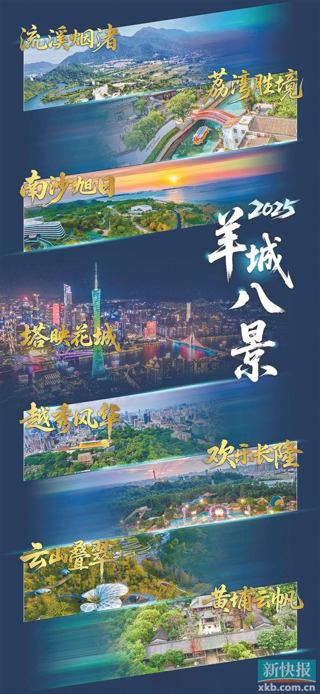
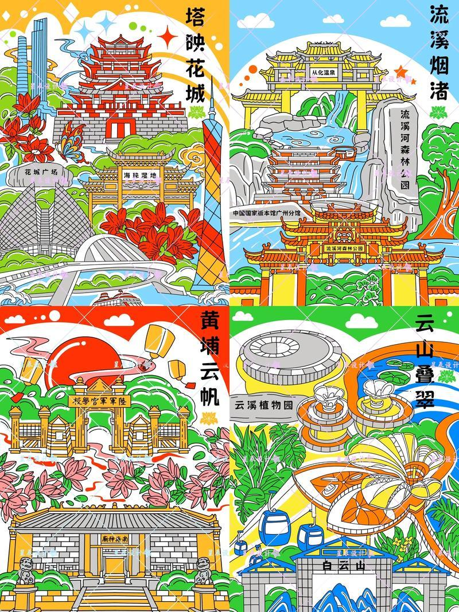

# 羊城八景

## 景点图片

## 基本信息

| 项目 | 内容 |
|------|------|
| 景点名称 | 羊城八景 |
| 所在城市 | 广州市 |
| 所在区县 | 越秀区 |
| 景点级别 | - |
| 景点类型 | 文化景观 |
| 开放时间 | 各景点开放时间不同 |
| 门票价格 | 各景点票价不同 |

## 景点介绍

羊城八景是广州市最具代表性的风景名胜的统称，是广州城市形象和文化底蕴的集中体现。"羊城八景"的评选历史悠久，历经宋、元、明、清及现代多次评选，是广州千年古城文化传承的重要载体。2025年8月3日，最新一届"羊城八景"在广州第十五届全运会倒计时100天活动中揭晓，首次采用片区组团形式评选。

### 2025年羊城八景

1. **塔映花城** —— 含广州塔、广州艺术博物院（广州美术馆）、花城广场、珠江夜韵、海珠湿地、广州市文化馆。以广州塔为核心，贯穿广州城市新中轴线。
2. **云山叠翠** —— 含白云山、云萝植物园、云溪植物园。自古"羊城第一秀"，城园共融的生态典范。
3. **越秀风华** —— 含北京路、南越王博物院、越秀公园、中山纪念堂。广州传统中轴线，千年城脉与文脉的精神图腾。
4. **荔湾胜境** —— 含永庆坊、陈家祠、白鹅潭、大湾区艺术中心、沙面。西关风韵，展现"最广州"的城市风貌。
5. **南沙旭日** —— 含南沙天后宫、蒲洲花园、南沙滨海公园、南沙湿地公园。湾区之心，向海而兴，展现大湾区澎湃活力。
6. **黄埔云帆** —— 含南海神庙、黄埔军校。海上丝绸之路起点与近现代革命摇篮。
7. **欢乐长隆** —— 广州长隆旅游度假区。广州向世界展示欢乐活力的烫金名片。
8. **流溪烟渚** —— 含流溪河国家森林公园、从化温泉旅游度假区、中国国家版本馆广州分馆。广州母亲河沿岸，生态之美与人文之韵的交融。

### 2011年羊城八景（历届参考）

2011年评选的"羊城新八景"包括：

1. **塔耀新城** —— 广州塔及珠江新城CBD，展现广州现代都市风貌
2. **珠水流光** —— 珠江夜景，两岸灯火璀璨，流光溢彩
3. **云山叠翠** —— 白云山，广州"市肺"，层峦叠翠
4. **越秀风华** —— 越秀山及镇海楼，广州历史文化的象征
5. **古祠流芳** —— 陈家祠（陈氏书院），岭南建筑艺术的瑰宝
6. **荔湾胜景** —— 荔枝湾涌及西关大屋，展现老广州风情
7. **科城锦绣** —— 广州科学城，体现广州科技创新活力
8. **湿地唱晚** —— 南沙湿地公园，城市与自然的和谐共生

## 景点特点

- **千年评选历史**：历经宋、元、明、清及现代多次评选，2025年为最新一届
- **广州城市名片**：集中展现广州自然与人文景观精华
- **古今交融**：涵盖历史古迹与现代都市景观
- **片区组团**：2025年评选首次采用片区组团形式，每景整合多个景点
- **文化传承**：是广州城市文化的重要载体

## 位置

- **覆盖范围**：广州市各区。2025年八景涵盖越秀区（北京路、越秀公园、中山纪念堂、南越王博物院）、海珠区（广州塔、广州艺术博物院、花城广场、海珠湿地、广州市文化馆）、白云区（白云山、云萝植物园）、荔湾区（永庆坊、陈家祠、白鹅潭、大湾区艺术中心、沙面）、南沙区（南沙天后宫、南沙湿地公园）、黄埔区（南海神庙、黄埔军校）、番禺区（长隆旅游度假区）、从化区（流溪河国家森林公园、从化温泉）等

## 交通

各景点交通方式详见对应景点页面。

## 数据来源

- [百度百科-羊城八景](https://baike.baidu.com/item/羊城八景)
- [百度百科-2025年"羊城八景"](https://baike.baidu.com/item/2025%E5%B9%B4%E2%80%9C%E7%BE%8A%E5%9F%8E%E5%85%AB%E6%99%AF%E2%80%9D)

## 最后更新时间

2026-06-28
