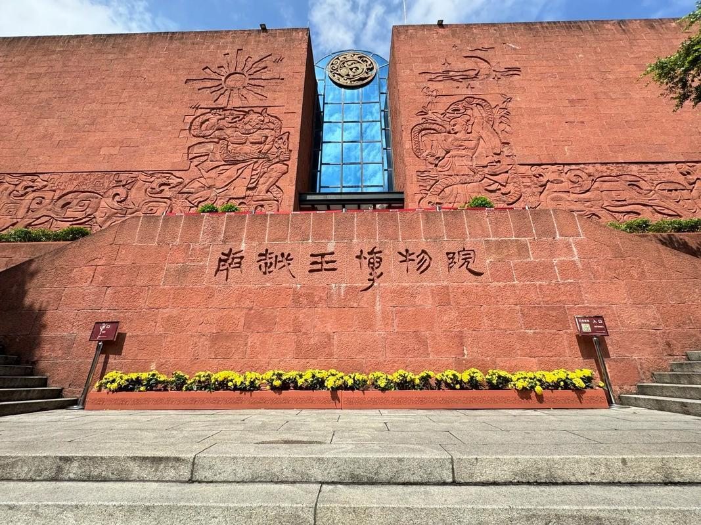

# 南越王博物院（含王墓景区和王宫景区）

## 景点图片

## 基本信息

| 项目 | 内容 |
|------|------|
| 景点名称 | 南越王博物院（含王墓景区和王宫景区） |
| 所在城市 | 广州市 |
| 所在区县 | 越秀区 |
| 景点级别 | 国家一级博物馆、4A级景区 |
| 景点类型 | 遗址博物馆 |
| 开放时间 | 王墓景区：09:00-17:30；王宫景区：09:00-17:30；周一闭馆 |
| 门票价格 | 王墓景区：10元/人；王宫景区：免费 |

## 景点介绍

南越王博物院由王墓景区和王宫景区两部分组成，全面展示南越国历史文化的考古遗址博物馆。

**王墓景区**位于广州市越秀区解放北路，是南越国第二代国王赵眜的陵墓原址上建造的遗址博物馆。南越王墓是岭南地区发现的规模最大、保存最完好的汉代彩绘石室墓，出土文物一万多件（套），包括丝缕玉衣、文帝行玺金印、角形玉杯、铜屏风构件等珍贵文物。其中丝缕玉衣是中国迄今发现的年代最早的一套形制完备的丝缕玉衣，文帝行玺金印是目前所见最大的一枚西汉金印。

**王宫景区**位于广州市越秀区北京路,是南越国宫署遗址，展示了南越国宫殿、御苑等遗迹。王宫景区包含南越国宫苑曲流石渠遗迹、南越国宫殿遗址、秦代造船遗址等，是广州作为岭南政治、经济、文化中心两千多年历史的实物见证。

## 景点特点

### 王墓景区

- **南越王墓**：岭南地区发现的规模最大、保存最完好的汉代彩绘石室墓
- **丝缕玉衣**：中国迄今发现的年代最早的一套形制完备的丝缕玉衣
- **文帝行玺金印**：目前所见最大的一枚西汉金印
- **出土文物丰富**：出土文物一万多件（套），包括众多国宝级文物

### 王宫景区

- **宫署遗址**：南越国宫殿、御苑等遗迹
- **曲流石渠**：南越国宫苑的曲流石渠遗迹，展现两千多年前的园林艺术
- **秦代造船遗址**：见证广州作为海上丝绸之路起点的重要实物

## 位置

### 王墓景区

- **地址**：广州市越秀区解放北路867号
- **经纬度**：23.1389°N, 113.2611°E

### 王宫景区

- **地址**：广州市越秀区北京路374号
- **经纬度**：23.1308°N, 113.2697°E

## 交通

### 王墓景区

- **地铁**：2号线越秀公园站E出口
- **公交**：5路、7路、24路、42路、58路、87路、101路、103路、105路、108路、109路、110路、113路、124路、180路、182路、185路、211路、244路、256路、265路、273路、284路、519路、528路、543路、555路等
- **自驾**：可停放至博物馆周边停车场

### 王宫景区

- **地铁**：1号线公园前站F出口
- **公交**：7路、12路、24路、42路、182路等
- **自驾**：可停放至北京路周边停车场

## 数据来源

- [南越王博物院官方网站](https://www.nywmuseum.org.cn)
- [百度百科-南越王博物院](https://baike.baidu.com/item/南越王博物院)

## 最后更新时间

2026-06-28
