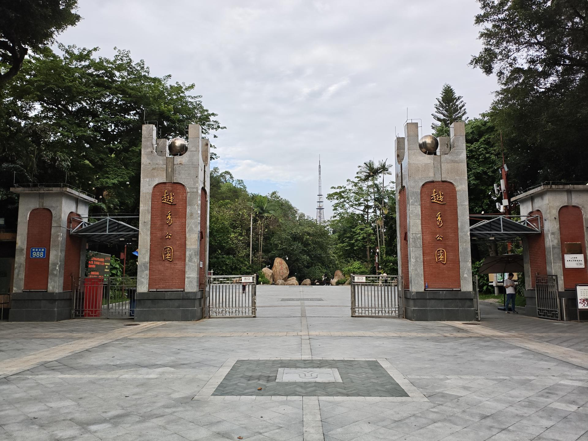

# 越秀公园

## 景点图片

## 基本信息

| 项目 | 内容 |
|------|------|
| 景点名称 | 越秀公园（含五羊雕像） |
| 所在城市 | 广州市 |
| 所在区县 | 越秀区 |
| 景点级别 | 4A级景区 |
| 景点类型 | 综合性公园/城市地标 |
| 开放时间 | 全天开放（五羊雕像区域：06:00-22:00） |
| 门票价格 | 免费 |

## 景点介绍

越秀公园是广州市最大的综合性公园，总面积约86万平方米，位于越秀区解放北路，是广州最早的公园之一。公园依托越秀山而建，园内山水相依，绿树成荫，是广州市民休闲娱乐的重要场所。

越秀公园最著名的景点当属**五羊石像**（五羊雕像），位于公园内的木壳岗上，是广州市的城徽。雕像建于1960年，由著名雕塑家尹积昌、陈本宗、孔繁纬创作，高约11米，由130多块花岗石雕刻而成。雕像展示了五只形态各异的羊，传说五位仙人骑五色羊、各携一茎六穗稻降临广州，祝愿此地永无饥荒，因此广州又被称为"羊城"、"穗城"。

公园内还有镇海楼（广州博物馆所在地）、明代古城墙遗址、中山纪念碑、四方炮台等历史遗迹，以及越秀山体育场、金印游乐场等设施。

## 景点特点

- **五羊石像**：广州城市标志，高约11米的花岗岩雕塑，是广州最具代表性的地标之一
- **镇海楼**：始建于明洪武十三年（1380年），现为广州博物馆，是广州现存最古老的楼阁之一
- **明代古城墙**：广州现存最完整的古城墙遗址
- **中山纪念碑**：纪念孙中山先生的纪念碑
- **越秀山体育场**：广州标志性体育场馆
- **自然风光**：园内有越秀湖、北秀湖等水体，绿化覆盖率极高

## 位置

- **地址**：广州市越秀区解放北路988号
- **经纬度**：23.1399°N, 113.2644°E

## 交通

- **地铁**：2号线越秀公园站B出口
- **公交**：5路、7路、24路、42路、58路、87路、101路、103路、105路、108路、109路、110路、113路、124路、180路、182路、185路、211路、244路、256路、265路、273路、284路、519路、528路、543路、555路等
- **自驾**：公园周边有多个停车场

## 数据来源

- [广州市越秀公园官方网站](http://www.yuexiupark.cn/)
- [百度百科-越秀公园](https://baike.baidu.com/item/越秀公园)

## 最后更新时间

2026-06-20
