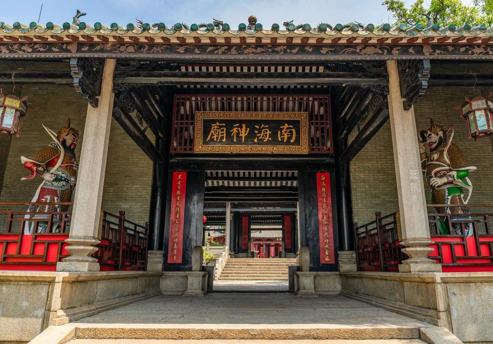

# 南海神庙

## 景点图片

## 基本信息

| 项目 | 内容 |
|------|------|
| 景点名称 | 南海神庙 |
| 所在城市 | 广州市 |
| 所在区县 | 黄埔区 |
| 景点级别 | 全国重点文物保护单位 |
| 景点类型 | 历史建筑/宗教寺庙 |
| 开放时间 | 09:00-17:00 |
| 门票价格 | 10元/人 |

## 景点介绍

南海神庙位于广州市黄埔区庙头村，始建于隋开皇十四年（公元594年），是中国古代东南西北四大海神庙中唯一保存下来的规模最大、最完整的海神庙，也是全国重点文物保护单位。

南海神庙是古代海上丝绸之路的重要见证。自唐代以来，凡经过广州的中外船舶，都要到南海神庙拜祭，祈求一帆风顺。庙内保存有大量珍贵的碑刻，其中最著名的是唐代韩愈撰写的《南海神广利王庙碑》。

南海神庙占地面积约3万平方米，由头门、仪门、礼亭、大殿等建筑组成。庙内古树参天，环境清幽。每年农历二月十一至十三的南海神庙庙会（又称"波罗诞"）是广州最大的民间庙会之一，吸引数十万游客前来。

## 景点特点

- **四大海神庙之首**：中国保存最完好的古代海神庙
- **海上丝绸之路见证**：古代海上丝绸之路的重要历史遗迹
- **韩愈碑刻**：唐代韩愈撰写的《南海神广利王庙碑》
- **波罗诞**：广州最大的民间庙会之一
- **全国重点文物保护单位**：重要的历史文化遗产

## 位置

- **地址**：广州市黄埔区庙头村
- **经纬度**：23.0833°N, 113.4500°E

## 交通

- **地铁**：13号线南海神庙站
- **公交**：多路公交至南海神庙站
- **自驾**：可停放至南海神庙停车场

## 数据来源

- [百度百科-南海神庙](https://baike.baidu.com/item/南海神庙)

## 最后更新时间

2026-06-20
