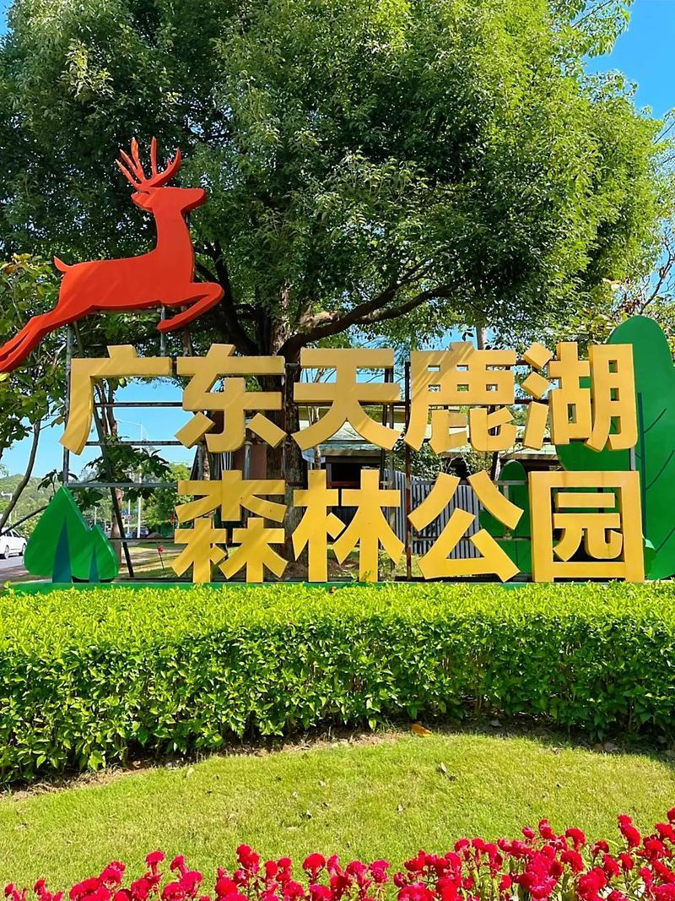

# 天鹿湖森林公园

## 景点图片

## 基本信息

| 项目 | 内容 |
|------|------|
| 景点名称 | 天鹿湖森林公园 |
| 所在城市 | 广州市 |
| 所在区县 | 黄埔区 |
| 景点级别 | - |
| 景点类型 | 森林公园 |
| 开放时间 | 全天开放 |
| 门票价格 | 免费 |

## 景点介绍

天鹿湖森林公园位于广州市黄埔区联和街道，占地约880万平方米，是广州市东部最大的森林公园之一。公园因园内的天鹿湖而得名，湖面面积约300亩，湖水清澈，四周群山环抱。

天鹿湖森林公园以原始次生林和天然湖泊为特色，森林覆盖率高达90%以上，是广州市区难得的天然氧吧。园内动植物资源丰富，有多种珍稀鸟类和植物。

公园设有环湖步道、登山步道、观景平台等设施，是广州市民周末登山、徒步、骑行的好去处。每年春季，园内的禾雀花盛开，吸引大量游客前来观赏。

## 景点特点

- **市区天然氧吧**：森林覆盖率90%以上
- **天鹿湖**：300亩天然湖泊
- **原始次生林**：保存完好的森林生态
- **禾雀花观赏**：春季特色花卉
- **免费开放**：市民休闲的好去处
- **户外运动**：登山、徒步、骑行

## 位置

- **地址**：广州市黄埔区联和街道天鹿湖森林公园
- **经纬度**：23.1833°N, 113.4333°E

## 交通

- **地铁**：6号线柯木塱站，转乘公交
- **公交**：333路、391路至天鹿湖森林公园站
- **自驾**：经广汕公路至天鹿湖路口

## 数据来源

- [百度百科-天鹿湖森林公园](https://baike.baidu.com/item/天鹿湖森林公园)

## 最后更新时间

2026-06-25
