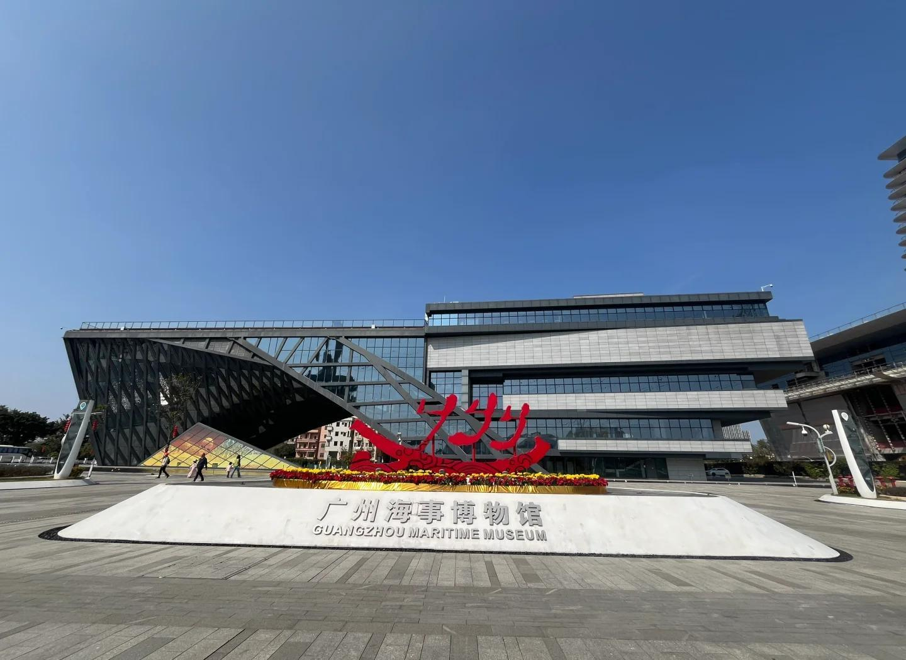
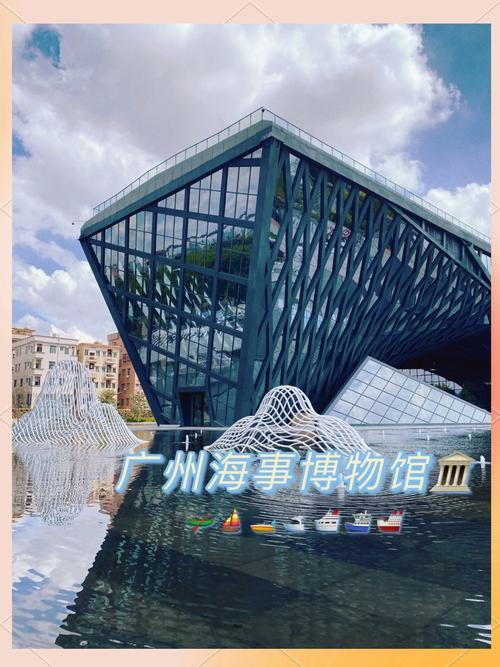

# 广州海事博物馆

## 景点图片

## 基本信息

| 项目 | 内容 |
|------|------|
| 景点名称 | 广州海事博物馆 |
| 所在城市 | 广州市 |
| 所在区县 | 黄埔区 |
| 景点级别 | - |
| 景点类型 | 博物馆 |
| 开放时间 | 09:00-17:00（周一闭馆） |
| 门票价格 | 免费 |

## 景点介绍

广州海事博物馆位于广州市黄埔区港前路，于2021年6月正式对外开放，是广州市唯一的海事专题博物馆。博物馆建筑面积约15000平方米，以"海事"为主题，全面展示广州作为海上丝绸之路重要起点的历史。

博物馆设有"七海扬帆——唐宋时期的广州与海上丝绸之路"基本陈列，通过大量出土文物、模型、场景复原和多媒体展示，再现了广州千年海事的辉煌历史。馆内最珍贵的文物包括南宋沉船"南海一号"出水的部分文物。

广州海事博物馆的建筑设计灵感来源于"海丝"主题，外观形似一艘扬帆起航的巨船，与周边的南海神庙、黄埔古港等景点共同构成广州海丝文化旅游线路。

## 景点特点

- **广州唯一海事专题博物馆**：2021年新开
- **海上丝绸之路主题**：展示广州千年海事历史
- **南海一号文物**：南宋沉船出水文物
- **现代展陈技术**：多媒体互动展示
- **免费开放**：公众可免费参观
- **建筑特色**：外观形似扬帆巨船

## 位置

- **地址**：广州市黄埔区港前路
- **经纬度**：23.0833°N, 113.4500°E

## 交通

- **地铁**：5号线鱼珠站，转乘公交
- **公交**：B31路、431路至海事博物馆站
- **自驾**：可停放至博物馆停车场

## 数据来源

- [广州海事博物馆官方网站](http://www.gzhsmuseum.com/)

## 最后更新时间

2026-06-25
