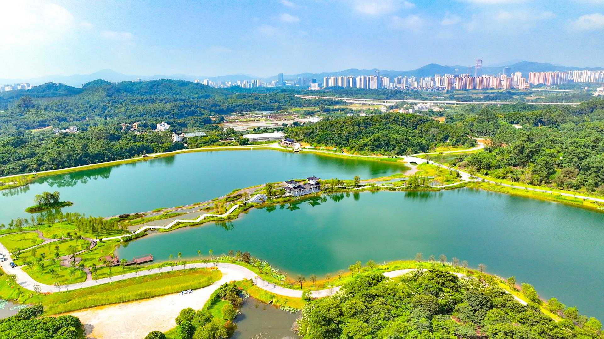

# 广州迳下乡村旅游景区

## 景点图片

## 基本信息

| 项目 | 内容 |
|------|------|
| 景点名称 | 广州迳下乡村旅游景区 |
| 所在城市 | 广州市 |
| 所在区县 | 黄埔区 |
| 景点级别 | 3A级景区 |
| 景点类型 | 乡村旅游景区 |
| 开放时间 | 村庄公共区域全天开放，营地、民宿及体验项目以各经营单位公告为准 |
| 门票价格 | 村庄公共区域免费，餐饮、采摘、露营等项目另行收费 |

## 景点介绍

广州迳下乡村旅游景区位于广州市黄埔区龙湖街迳下村，地处中新广州知识城中部。景区依托村内农业、生态、旅游和红色文化资源，发展农耕种植、生态美食、沉浸式民宿、劳动研学和创意活动等“文旅+农业”业态。

迳下村先后获评国家3A级旅游景区、省级文化和旅游特色村、“广州名村”和“广州市美丽乡村”，并入选2023年全国“村晚”示范展示点。水系碧带、火车花园营地和田园景观是村内主要游览空间，具体活动及接待安排以景区当日公告为准。

## 景点特点

- **乡村复合业态**：融合农业、餐饮、民宿、研学和创意活动
- **水系田园景观**：村内水系碧带连接农田与公共空间
- **劳动研学**：依托农业资源开展自然教育和农事实践
- **示范村落**：入选2023年全国“村晚”示范展示点

## 位置

- **地址**：广州市黄埔区龙湖街迳下村
- **经纬度**：23.3372°N, 113.5687°E

## 交通

- **地铁公交**：地铁14号线支线何棠下站转乘知识城片区公交前往迳下村
- **自驾**：导航至迳下村，停车和节假日接驳安排以现场指引为准

## 数据来源

- [广州市黄埔区人民政府：广州迳下乡村旅游景区](https://www.hp.gov.cn/gzjg/qzfgwhgzbm/qwhgdlyj/xxgk/content/post_10299500.html)
- [广州市文化广电旅游局：2025年度国家3A级旅游景区质量等级复核结果](https://wglj.gz.gov.cn/xxgk/gzdt/tzgsgg/content/post_10480870.html)
- 图片来源：广州市黄埔区人民政府

## 最后更新时间

2026-07-14
