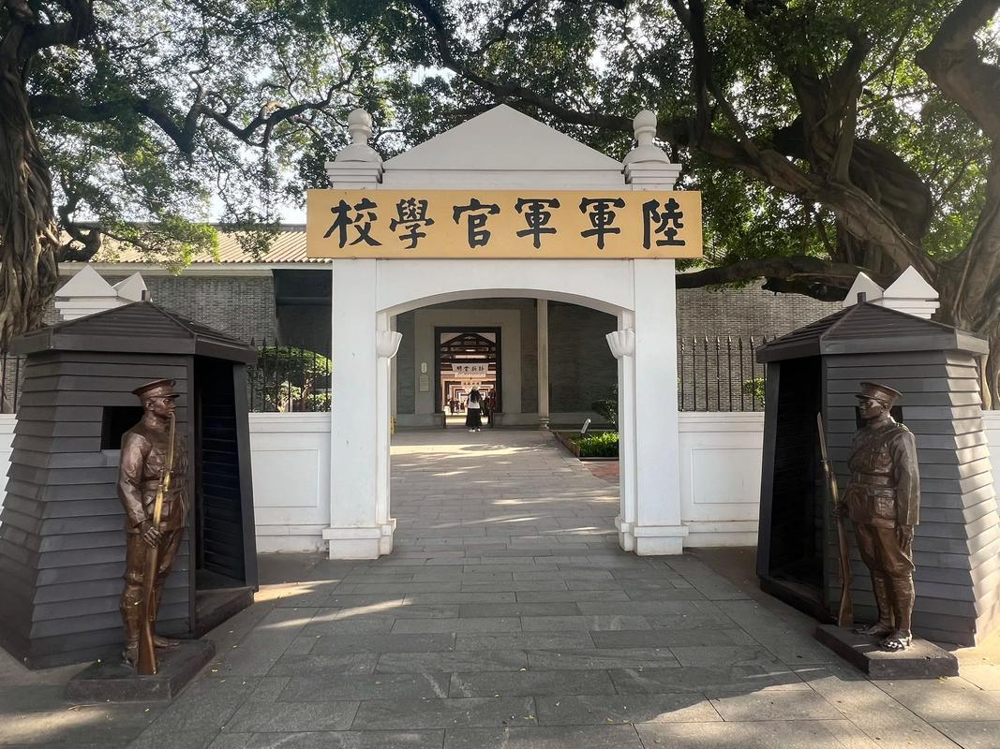

# 黄埔军校旧址

## 景点图片

## 基本信息

| 项目 | 内容 |
|------|------|
| 景点名称 | 黄埔军校旧址（陆军军官学校旧址） |
| 所在城市 | 广州市 |
| 所在区县 | 黄埔区 |
| 景点级别 | 全国重点文物保护单位 |
| 景点类型 | 历史遗址/纪念馆 |
| 开放时间 | 09:00-17:00（16:30停止入馆）；周一闭馆（法定节假日除外） |
| 门票价格 | 免费 |

## 景点介绍

黄埔军校旧址位于广州市黄埔区长洲岛，是第一次国共合作时期，孙中山先生在中国共产党和苏联帮助下，于1924年创办的陆军军官学校旧址。黄埔军校是中国近代史上最著名的军事学校，培养了大批军事人才，被誉为"将军的摇篮"。

旧址现存有军校大门、孙总理纪念室（俗称"中山故居"）、俱乐部、游泳池、东征烈士墓、北伐纪念碑等建筑和遗迹。现辟为黄埔军校旧址纪念馆，馆内设有"黄埔军校史迹展"、"黄埔群英馆"等多个陈列，通过大量珍贵的历史照片、文物和资料，全面展示了黄埔军校的光辉历史。

## 景点特点

- **将军摇篮**：中国近代史上最著名的军事学校，培养了大批军事人才
- **革命圣地**：第一次国共合作的重要历史见证
- **历史建筑**：保留有军校大门、中山故居、俱乐部等原始建筑
- **免费开放**：免费参观（需提前预约）
- **爱国主义教育基地**：全国爱国主义教育示范基地

## 位置

- **地址**：广州市黄埔区长洲岛军校路170号
- **经纬度**：23.0861°N, 113.4247°E

## 交通

- **地铁**：5号线鱼珠站，转乘公交或轮渡至长洲岛
- **公交**：383路、430路等至黄埔军校站
- **自驾**：可经由长洲大桥到达，岛内有停车场

## 数据来源

- [黄埔军校旧址纪念馆官方网站](http://www.hpjnxz.com/)
- [百度百科-黄埔军校旧址](https://baike.baidu.com/item/黄埔军校旧址)

## 最后更新时间

2026-06-20
