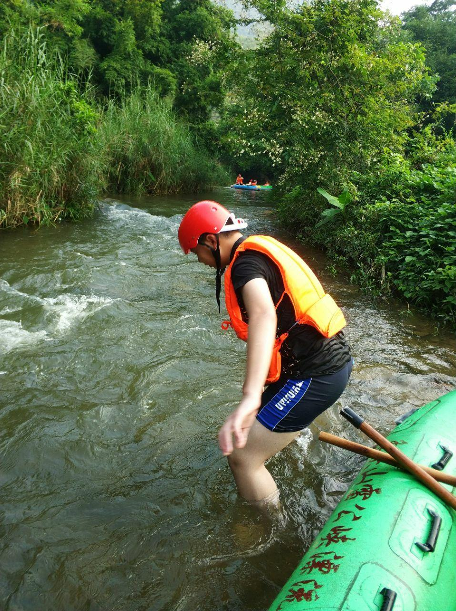

# 雷公峡生态旅游区

## 景点图片

> 图片来源：[携程攻略](https://youimg1.c-ctrip.com/target/100q0j000000ar5yo8EA7.jpg)

## 景点介绍

雷公峡生态旅游区位于惠州市博罗县泰美镇的象头山自然保护区内，是国家AAA级旅游景区。景区以纯生态漂流为主要特色，拥有长达4.5公里的天然河道，落差近百米，沿途约有20个落差点，漂流体验惊险刺激。漂流河道两岸青山绿水、林木葱郁，生态环境优美。除漂流外，景区还设有生态观光步道、森林氧吧等设施，游客可享受山水自然风光。雷公峡漂流每年4月至12月开放，是广东省知名的漂流目的地之一，适合夏季避暑和户外运动爱好者。

## 景点特点

- 以纯生态漂流为主要特色，河道全长约4.5公里
- 落差近百米，沿途约20个落差点，漂流体验刺激
- 位于象头山自然保护区内，生态环境优美
- 设有生态观光步道、森林氧吧等设施
- 每年4月至12月开放，是广东省知名漂流胜地

## 位置

- **地址**：惠州市博罗县泰美镇罗营村
- **经纬度**：23.3322°N, 114.4407°E

## 交通

- **自驾**：从惠州市区沿G25长深高速至泰美出口下，经县道前往泰美镇罗营村
- **公交**：惠州市汽车客运站乘坐至泰美镇的班车，在泰美镇下车后打车前往罗营村

## 数据来源

- [惠州市人民政府 · 惠州市国家A级旅游景区名录(2025年3月)](https://www.huizhou.gov.cn/zdlyxxgk/lyscjgzfxxgk/cyzl/content/post_5474432.html)

## 最后更新时间

2026-07-19
