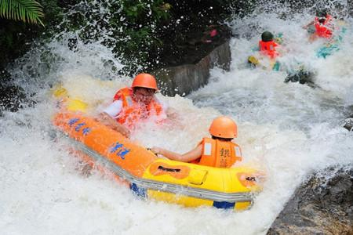

# 碧海湾旅游度假区

## 景点图片

> 图片来源：[去哪儿旅行](https://img1.qunarzz.com/travel/poi/1409/01/514225253ace837affffffffc8d65eac.jpg)

## 景点介绍

碧海湾旅游度假区位于惠州市大亚湾西区，是一个集漂流、水上乐园、烧烤、露营、住宿于一体的综合性生态度假区。这里拥有美丽的海岸线和丰富的海洋资源，夏季以漂流和水上娱乐项目为主要特色。

碧海湾旅游度假区占地面积广阔，依托大亚湾的自然滨海资源，开发了多种休闲娱乐项目。景区内的漂流项目全长约3公里，落差适中，适合家庭游玩；水上乐园则配备了多种滑梯等水上娱乐设施，是夏日避暑的好去处。此外，景区还提供沙滩休闲、海上运动、烧烤露营等服务，满足不同游客的需求。

## 景点特点

- 漂流项目（全长约3公里，落差适中，适合家庭游玩）
- 水上乐园（多种滑梯等水上娱乐设施）
- 沙滩休闲和海上活动（摩托艇、帆船等）
- 烧烤和露营设施
- 海鲜餐饮
- 多种住宿选择

## 位置

- **地址**：惠州市大亚湾小桂碧海湾旅游度假区
- **经纬度**：22.6791°N, 114.51°E

## 交通

- **自驾**：从深圳出发，沿惠深沿海高速至小桂出口，距入口仅300米；从惠州市区出发可经沿海高速直达
- **公共交通**：可乘坐惠州公交K2路转乘专线车，或在大亚湾区内换乘当地巴士

## 数据来源

- [惠州市人民政府 · 惠州市国家A级旅游景区名录(2025年3月)](https://www.huizhou.gov.cn/zdlyxxgk/lyscjgzfxxgk/cyzl/content/post_5474432.html)
- [广东省文化和旅游厅 · 惠州大亚湾碧海湾旅游度假区](https://baike.baidu.com/item/%E5%B9%BF%E4%B8%9C%E7%9C%81)
- [百度百科 · 碧海湾旅游度假区](https://baike.baidu.com/item/碧海湾旅游度假区/)
- [惠州市人民政府](http://www.huizhou.gov.cn/)

## 最后更新时间

2026-07-19
