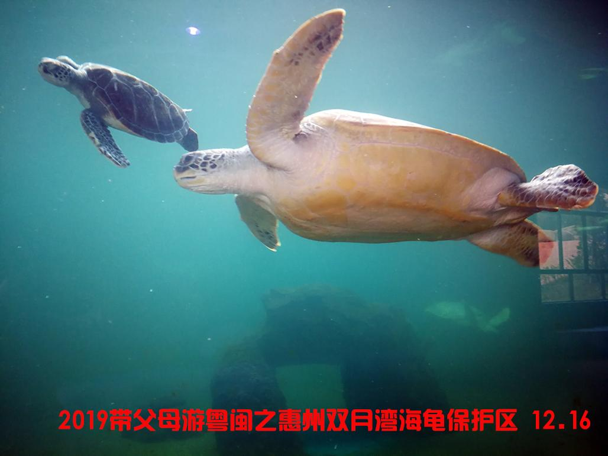

# 海龟湾自然保护区

## 景点图片

> 图片来源：[去哪儿旅行](https://tr-osdcp.qunarzz.com/tr-osd-tr-space/img/e49539e9d1fe79f1d903835b10ffda5a.jpg)

## 景点介绍

海龟湾位于惠州市惠东县港口滨海旅游度假区，是中国唯一的海龟国家级自然保护区。保护区拥有美丽的海岸线和丰富的海洋生物资源，是观赏海龟和享受海滨风光的理想之地。这里不仅是海龟的重要繁殖地，还拥有蜿蜒的海岸栈道、清澈的海水和细腻的沙滩，是集生态保护、科普教育和休闲旅游于一体的综合性景区。

## 景点特点

- 中国唯一的海龟国家级自然保护区
- 国家3A级旅游景区
- 拥有美丽的海岸线和丰富的海洋生物资源
- 海龟重要繁殖地，可进行科普教育
- 蜿蜒的海岸栈道，适合徒步和摄影
- 清澈海水和细腻沙滩，海滨风光优美

## 位置

- **地址**：广东省惠州市惠东县港口滨海旅游度假区海龟湾
- **经纬度**：22.5649°N, 114.9023°E

## 交通

- **自驾**：导航至海龟湾自然保护区，从惠州市区出发约1小时
- **公交**：可乘坐公交至小径湾站下车，步行前往
- **出租车**：从大亚湾区打车约30-40元

## 数据来源

- 惠州市文化广电旅游体育局
- 国家4A级旅游景区名录
- 大亚湾经济技术开发区管委会

## 最后更新时间

2026-07-19

