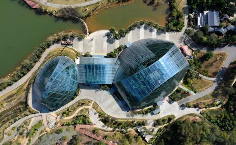

# 惠州植物园

## 景点图片

> 图片来源：[百度百科](https://bkimg.cdn.bcebos.com/smart/8601a18b87d6277f9e2f7280a0620830e924b899564a-bkimg-process,v_1,rw_3840,rh_2352,maxl_463?x-bce-process=image/format,f_auto)

## 基本信息

| 项目 | 内容 |
|------|------|
| 景点名称 | 惠州植物园 |
| 所在城市 | 惠州市 |
| 所在区县 | 惠城区 |
| 景点级别 | 无 |
| 景点类型 | 植物园 |
| 开放时间 | 08:00-18:00 |
| 门票价格 | 免费 |

## 景点介绍

惠州植物园位于惠州市惠城区，占地面积约100公顷，是惠州市最大的植物园，也是惠州市重要的生态绿地。植物园以展示热带和亚热带植物为主题，拥有各种植物1000多种。

惠州植物园分为科普展览区、植物观赏区、生态保护区等多个功能区域。园内有芳香植物区、药用植物区、水生植物区、棕榈园、兰花园等专类园区，以及人工湖、草坪、亭台楼阁等景观设施。

惠州植物园是惠州市民休闲观光和科普教育的重要场所，与惠州西湖、红花湖等景点共同构成了惠州市的生态旅游体系。

## 景点特点

- **惠州市最大的植物园**：占地面积约100公顷
- **热带亚热带植物**：拥有各种植物1000多种
- **专类园区**：芳香植物区、药用植物区、水生植物区等
- **免费开放**：惠州市民休闲观光的好去处
- **生态旅游**：与惠州西湖、红花湖共同构成生态旅游体系

## 位置

- **地址**：惠州市惠城区下角丰山一路
- **经纬度**：23.0958°N, 114.3799°E

## 交通

- **公交**：惠州市内多路公交可达
- **自驾**：可停放至植物园停车场

## 数据来源

- [百度百科-惠州植物园](https://baike.baidu.com/item/惠州植物园)

## 最后更新时间

2026-07-19

