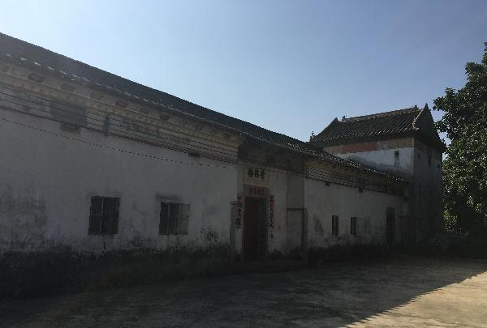

# 秋长古镇

## 景点图片

> 图片来源：[新浪网](http://n.sinaimg.cn/sinacn15/205/w600h405/20180731/a8a4-hhacrce2732394.jpg)

## 位置

- **地址**：广东省惠州市惠阳区秋长街道
- **经纬度**：22.8113°N, 114.4214°E

## 交通

- **自驾**：导航至秋长古镇，从惠州市区出发约40分钟
- **公交**：可乘坐公交至秋长镇下车
- **出租车**：从惠阳区打车约20-30元

## 数据来源

- 惠州市文化广电旅游体育局
- 惠阳区人民政府官网
- 各大旅游平台公开信息

## 最后更新时间

2026-07-19
