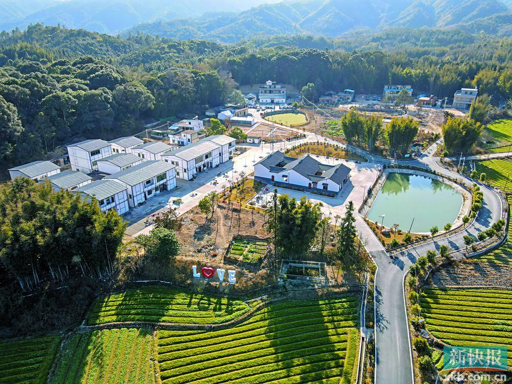

# 上东瑶乡风情旅游景区

## 景点图片

> 图片来源：[新浪网](https://n.sinaimg.cn/sinakd20221015s/150/w1000h750/20221015/bb32-3027f2b38867cff7c01de7a42decc578.jpg)

## 景点介绍

上东瑶乡风情旅游景区位于龙门县蓝田瑶族乡上东村，是龙门县展示瑶族文化的重要窗口。蓝田瑶族乡是广东省唯一的瑶族乡，拥有丰富的瑶族传统文化和民俗资源。景区依托上东村的自然风光和瑶族文化，打造了集瑶族风情展示、民俗体验、生态观光于一体的旅游景区。

蓝田瑶族乡因传说中有蓝氏族人于此建乡而得名，全乡以瑶族人口为主，保留了浓郁的瑶族风情和传统文化。景区内设有瑶族文化展览馆，展示瑶族服饰、生活器具、传统手工艺品等，游客可以近距离感受瑶族文化的独特魅力。

## 景点特点

- 瑶族传统建筑和村落风貌
- 瑶族民俗表演（歌舞、传统手工艺等）
- 瑶族特色餐饮（五色糯米饭、瑶家腊肉等）
- 瑶族文化展览馆
- 自然风光包括蓝田温泉、瀑布群、原始森林等

## 位置

- **地址**：惠州市龙门县蓝田瑶族乡上东村委会
- **经纬度**：23.9145°N, 114.2067°E

## 交通

- **自驾**：从惠州市区出发，经广河高速至龙门县，再沿县道前往蓝田瑶族乡（距龙门县城约18公里）
- **公共交通**：从惠州客运站乘车到龙门县，再转乘当地客运到蓝田瑶族乡

## 数据来源

- [惠州市人民政府 · 惠州市国家A级旅游景区名录(2025年3月)](https://www.huizhou.gov.cn/zdlyxxgk/lyscjgzfxxgk/cyzl/content/post_5474432.html)

## 最后更新时间

2026-07-19
