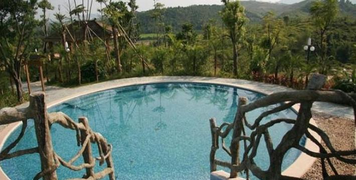

# 尚天然温泉旅游景区

## 景点图片

> 图片来源：[去哪儿旅行](https://imgs.qunarzz.com/sight/p0/201403/10/b30f6ce59c09d887045ccc4764b7c5cb.jpg_710x360_342008c8.jpg)

## 基本信息

| 项目 | 内容 |
|------|------|
| 景点名称 | 尚天然温泉旅游景区 |
| 所在城市 | 惠州市 |
| 所在区县 | 龙门县 |
| 景点级别 | 4A级景区 |
| 景点类型 | 温泉度假区 |
| 开放时间 | 09:00-24:00 |
| 门票价格 | 约128元 |

## 景点介绍

尚天然温泉旅游景区位于惠州市龙门县龙田镇赖屋村，是国家4A级温泉旅游度假区。景区地处南昆山脚下，拥有丰富的地热温泉资源，温泉水质优良，富含多种对人体有益的微量元素。

景区内有室内外温泉池、水上乐园、度假酒店等配套设施，是集温泉养生、休闲娱乐、会议培训于一体的综合性旅游度假区。拥有各类温泉泡池300余个，包括药浴池、SPA池、儿童戏水池等多种类型。

## 景点特点

- **国家4A级景区**：龙门县标志性温泉度假区
- **优质温泉**：地处南昆山脚下，地热资源丰富
- **泡池丰富**：拥有各类温泉泡池300余个
- **配套设施完善**：含水上乐园、度假酒店等
- **养生度假**：集温泉养生、休闲娱乐于一体

## 位置

- **地址**：惠州市龙门县龙田镇赖屋村
- **经纬度**：22.9459°N, 114.3286°E

## 交通

- **自驾**：导航至尚天然温泉旅游景区，从惠州市区出发约1.5小时
- **公交**：龙门县有公交可达

## 数据来源

- [惠州市文化广电旅游体育局](http://wgltj.huizhou.gov.cn/)

## 最后更新时间

2026-07-19

