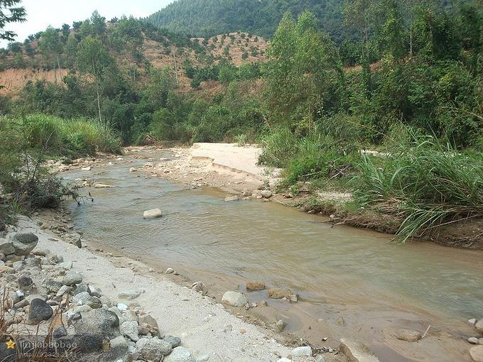

# 龙门山下白芒坑景区

## 景点图片

> 图片来源：[去哪儿旅行](https://img1.qunarzz.com/travel/d1/201408/07/f3a653ac8cbcc925c8d65eac.jpg_r_680x510x95_d8a995d8.jpg)

## 景点介绍

白芒坑景区位于龙门县平陵街道山下村，地处龙门山脚下，是一个集自然风光和客家文化于一体的生态旅游景区。这里拥有独特的喀斯特地貌、茂密的森林、清澈的溪流，以及保存完好的客家古村落。2024年获批国家3A级旅游景区，被誉为"龙门后花园"。

白芒坑景区依托龙门山的自然山水资源，开发了徒步登山、溪边戏水、水果采摘等多种体验活动。景区内保留了传统的客家村落风貌，古桥、古榕树等自然景观与人文建筑交相辉映，展现了岭南山区的独特魅力。

## 景点特点

- 原生态山林景观和清澈溪流
- 喀斯特地貌
- 传统客家村落，保留明清时期古建筑
- 白芒坑古桥、千年古榕等特色景点
- 客家美食体验（龙门胡须鸡、梅菜扣肉等）
- 徒步登山、溪边戏水、水果采摘等体验活动

## 位置

- **地址**：惠州市龙门县平陵街道山下村白芒坑
- **经纬度**：23.6841°N, 114.3637°E

## 交通

- **自驾**：从龙门县城出发，沿X213省道向北行驶约15公里即可到达；或从惠州市区经广河高速至龙门出口下，再沿X213县道前往平陵街道山下村
- **公共交通**：从惠州客运站乘车到龙门县，再转乘当地客运到平陵街道，最后打车或步行到达

## 数据来源

- [惠州市人民政府 · 惠州市国家A级旅游景区名录(2025年3月)](https://www.huizhou.gov.cn/zdlyxxgk/lyscjgzfxxgk/cyzl/content/post_5474432.html)

## 最后更新时间

2026-07-19
