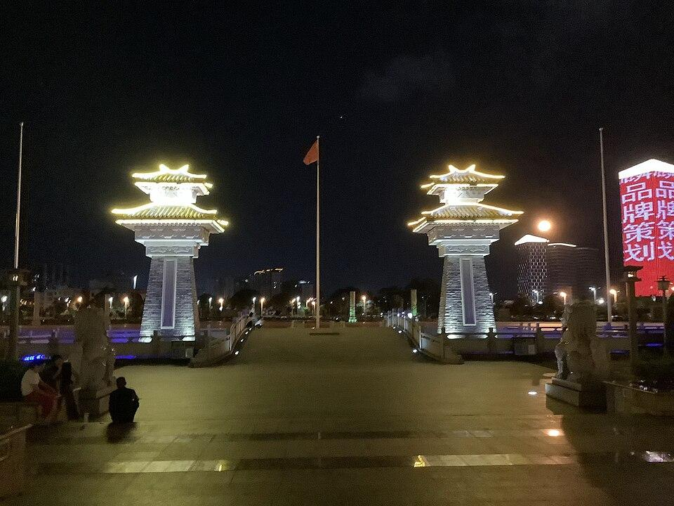

# 揭阳楼

## 景点图片

> 图片来源：[Wikimedia Commons](https://commons.wikimedia.org/wiki/File:%E6%8F%AD%E9%98%B3%E6%A5%BC%E5%B9%BF%E5%9C%BA%2003.jpg) · 许可证：CC BY-SA 4.0

## 基本信息

| 项目 | 内容 |
|------|------|
| 景点名称 | 揭阳楼 |
| 所在城市 | 揭阳市 |
| 所在区县 | 榕城区 |
| 景点级别 | 市级地标 |
| 景点类型 | 地标 |
| 开放时间 | 09:00-17:30 |
| 门票价格 | 免费 |

## 景点介绍

揭阳楼位于揭阳市榕城区，是揭阳市的标志性建筑和文化地标。揭阳楼以传统岭南建筑风格建造，楼高数层，飞檐翘角，气势恢宏，是揭阳城市建设的点睛之笔。

揭阳楼坐落于揭阳楼广场内，广场环境优美，是市民休闲娱乐的重要场所。楼内设有展厅，展示揭阳的历史文化、风土人情和发展成就，是了解揭阳的重要窗口。登楼远眺，可俯瞰揭阳城区全景，感受揭阳的城市风貌。

## 景点特点

- **城市地标**：揭阳市最具代表性的现代地标建筑
- **岭南风格**：建筑采用传统岭南建筑风格，古朴典雅
- **文化展示**：楼内设有展览，展示揭阳历史文化
- **广场休闲**：周边广场环境优美，适合休闲散步
- **免费开放**：不收取门票，便于市民和游客参观

## 位置

- **地址**：揭阳市榕城区揭阳楼广场
- **经纬度**：23.5658°N, 116.3929°E

## 交通

- **公交**：可乘坐揭阳市区多路公交至揭阳楼站
- **自驾**：导航至"揭阳楼"，位于榕城区中心地带
- **步行**：位于市区核心区域，适合步行前往

## 数据来源

- [揭阳市文化广电旅游体育局](http://www.jieyang.gov.cn/)

## 最后更新时间

2026-06-20
