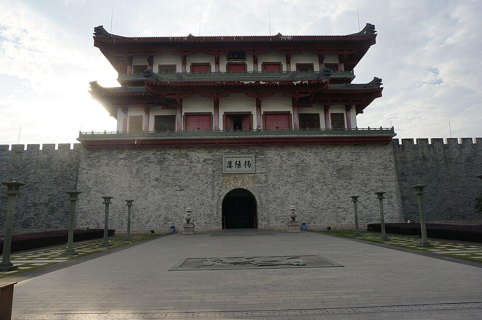

# 进贤门

## 景点图片

> 图片来源：[Wikimedia Commons](https://commons.wikimedia.org/wiki/File:Jieyang%20Gate%20Tower.jpg) · 许可证：CC BY-SA 4.0

## 基本信息

| 项目 | 内容 |
|------|------|
| 景点名称 | 进贤门 |
| 所在城市 | 揭阳市 |
| 所在区县 | 榕城区 |
| 景点级别 | 市级文物保护单位 |
| 景点类型 | 历史建筑 |
| 开放时间 | 全天开放 |
| 门票价格 | 免费 |

## 景点介绍

进贤门位于揭阳市榕城区，始建于明万历年间（1573-1620年），是揭阳古城的标志性建筑之一。进贤门原为揭阳古城东门，因城门上建有城楼，又称"进贤门城楼"，是揭阳保存最完整的古城门之一。

进贤门城楼为砖石结构，高约12米，门洞上方镶嵌"进贤门"石匾。城楼飞檐翘角，古朴庄重，是揭阳古城历史的重要见证。城门下曾是古城进出的重要通道，见证了揭阳数百年的沧桑变迁。

## 景点特点

- **历史悠久**：始建于明代，距今已有四百多年历史
- **古城标志**：揭阳古城最具代表性的历史建筑之一
- **建筑特色**：砖石结构，飞檐翘角，体现岭南建筑风格
- **文化底蕴**：承载着揭阳古城的历史记忆和文化传承
- **免费开放**：全天可参观，便于游客游览

## 位置

- **地址**：揭阳市榕城区进贤门大道
- **经纬度**：23.5298°N, 116.3671°E

## 交通

- **公交**：可乘坐揭阳市区公交至进贤门站
- **自驾**：导航至"进贤门"，位于榕城区中心地带
- **步行**：位于市区中心，适合步行前往

## 数据来源

- [揭阳市文化广电旅游体育局](http://www.jieyang.gov.cn/)

## 最后更新时间

2026-06-20
