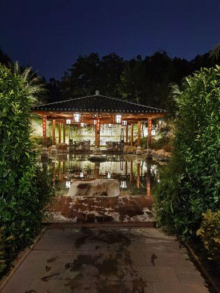

# 汤湖热矿泥山庄

## 景点图片

> 图片来源：[高德地图](https://www.amap.com/search?query=汤湖热矿泥山庄)

## 基本信息

| 项目 | 内容 |
|------|------|
| 景点名称 | 汤湖热矿泥山庄 |
| 所在城市 | 梅州市 |
| 所在区县 | 五华县 |
| 景点级别 | 省级休闲农业与乡村旅游示范点 |
| 景点类型 | 温泉度假 / 康养疗养 |
| 开放时间 | 08:00-21:00（周一至周日） |
| 门票价格 | 免费进入，热矿泥体验另行收费 |

## 景点介绍

汤湖热矿泥山庄位于广东省梅州市五华县汤湖镇，是粤东地区以天然热矿泥资源为特色的温泉康养度假胜地。五华县拥有丰富的地热资源，汤湖镇一带更是著名的热矿泥产地，其天然热矿泥富含多种对人体有益的矿物质和微量元素，具有独特的保健理疗功效，在华南地区享有盛誉。

山庄充分利用当地得天独厚的热矿泥资源和自然山水环境，打造了集热矿泥体验、温泉沐浴、生态观光、客家美食于一体的综合度假场所。游客可以在此享受热矿泥敷身、泡温泉等传统客家养生疗法，感受天然矿泥带来的舒缓与放松。山庄周边山水环绕，竹林摇曳，空气清幽，远离城市喧嚣，是周末休闲度假和康养疗养的绝佳去处。汤湖热矿泥作为五华县的特产名片，不仅深受本地居民喜爱，也吸引了众多来自珠三角等地的游客专程前来体验。

## 景点特点

- **天然热矿泥**：富含多种矿物质和微量元素，保健理疗功效显著
- **温泉康养**：融合热矿泥与温泉的养生度假体验
- **客家养生传统**：传承当地独特的客家热矿泥疗法
- **山水田园环境**：山庄被竹林青山环绕，空气清新宁静
- **特产名片**：汤湖热矿泥是五华县知名特产
- **综合度假功能**：集体验、疗养、观光、美食于一体

## 位置

- **地址**：梅州市五华县汤湖镇
- **经纬度**：23.9792°N, 115.6586°E

## 交通

- **自驾**：从梅州市区沿广梅汕高速至五华出口，转入县道至汤湖镇，导航至"汤湖热矿泥山庄"
- **公交**：从梅州市汽车站乘坐前往五华县汤湖镇的班车至汤湖镇，再步行或打车前往热矿泥山庄

## 数据来源

- [百度百科-汤湖热矿泥山庄](https://baike.baidu.com/item/%E6%B1%A4%E6%B9%96%E7%83%AD%E7%9F%BF%E6%B3%A5%E5%B1%B1%E5%BA%84)

## 最后更新时间

2026-07-17
