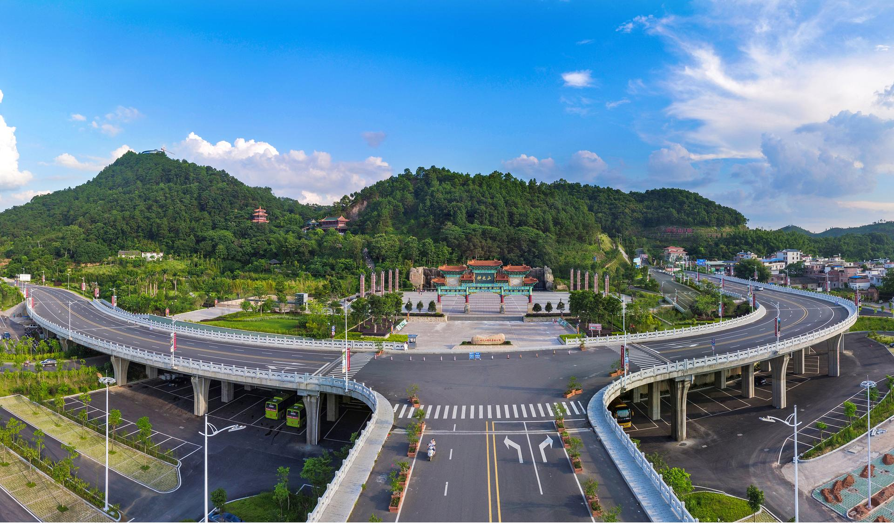

# 神光山

## 景点图片

> 图片来源：[携程攻略](https://you.ctrip.com/sight/523/51328.html)

## 基本信息

| 项目 | 内容 |
|------|------|
| 景点名称 | 神光山国家森林公园 |
| 所在城市 | 梅州市 |
| 所在区县 | 兴宁市 |
| 景点级别 | 4A级景区 |
| 景点类型 | 森林公园 |
| 开放时间 | 06:00-22:00 |
| 门票价格 | 免费 |

## 景点介绍

神光山位于梅州市兴宁市，是国家AAAA级旅游景区，也是兴宁市最著名的自然景观。神光山海拔约380米，因传说古代有神光出现而得名，是兴宁市的标志性山峰。

神光山国家森林公园面积约674公顷，拥有丰富的森林资源和人文景观。山上有神光寺、石古大王庙、望兴亭等众多景点。神光寺始建于宋代，是兴宁市最古老的寺庙之一。望兴亭是山顶的观景台，可俯瞰兴宁城区全貌。

神光山是兴宁市民休闲健身的热门去处，每年吸引大量游客前来登山、观光和祈福。

## 景点特点

- **兴宁市标志性山峰**：海拔约380米
- **神光寺**：始建于宋代，兴宁最古老的寺庙之一
- **国家森林公园**：面积约674公顷
- **登高望远**：可俯瞰兴宁城区全貌
- **免费开放**：兴宁市民休闲健身的热门去处

## 位置

- **地址**：梅州市兴宁市神光山
- **经纬度**：24.0986°N, 115.7177°E

## 交通

- **自驾**：梅州市区出发约40分钟车程
- **公交**：兴宁市内多路公交可达

## 数据来源

- [百度百科-神光山国家森林公园](https://baike.baidu.com/item/%E7%A5%9E%E5%85%89%E5%B1%B1%E5%9B%BD%E5%AE%B6%E6%A3%AE%E6%9E%97%E5%85%AC%E5%9B%AD)
- [携程攻略-神光山](https://you.ctrip.com/sight/523/51328.html)

## 最后更新时间

2026-07-17
