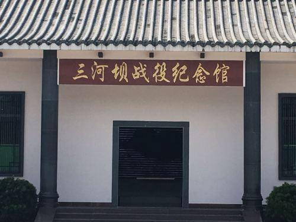

# 三河坝战役纪念园

## 景点图片

> 图片来源：[高德地图](https://www.amap.com/search?query=三河坝战役纪念园)

## 基本信息

| 项目 | 内容 |
|------|------|
| 景点名称 | 三河坝战役纪念园 |
| 所在城市 | 梅州市 |
| 所在区县 | 大埔县 |
| 景点级别 | 全国爱国主义教育示范基地 |
| 景点类型 | 红色旅游景点 |
| 开放时间 | 8:30-17:30 |
| 门票价格 | 免费 |

## 景点介绍

三河坝战役纪念园位于梅州市大埔县三河镇，是为纪念1927年"八一"南昌起义军在三河坝阻击敌军的光辉历史而建立的红色旅游景点。1927年10月，南昌起义后，朱德率领起义军余部约3000人在三河坝阻击敌军约15000人，激战三天三夜。在这场力量悬殊的战役中，起义军将士以顽强的战斗意志和英勇的牺牲精神，为保存革命火种做出了重大贡献，创造了革命战争史上的奇迹。三河坝战役打响了中国共产党独立领导武装斗争的第一枪的延续之战，在中国革命史上具有举足轻重的地位。纪念园内设有纪念馆、纪念碑、烈士墓等纪念设施，充分展现了这段波澜壮阔的革命历史。

## 景点特点

- **红色教育基地**：全国爱国主义教育示范基地，是开展党史学习和革命传统教育的理想场所
- **战斗遗址保存完好**：原战场遗迹、纪念碑等得到了完整保留，真实还原了当年的战斗场景
- **重大历史意义**：朱德率3000人阻击15000人，激战三天三夜，展现了革命军人不屈的斗争精神
- **纪念设施完善**：园内设有纪念馆、纪念碑、雕塑、烈士墓等，陈列丰富史料和文物
- **环境优美**：位于韩江畔，山水相依，庄严肃穆的纪念氛围与自然山水融为一体

## 位置

- **地址**：梅州市大埔县三河镇
- **经纬度**：24.4°N, 116.5802°E

## 交通

- **自驾**：从大埔县城出发，沿梅坎公路（梅坎大道）向北行驶约30公里即可到达三河镇，全程路况良好，约40分钟车程
- **公交**：可在大埔县城乘坐前往三河镇的客运班车，在三河镇下车后步行约10分钟即可到达纪念园

## 数据来源

- [百度百科-三河坝战役](https://baike.baidu.com/item/%E4%B8%89%E6%B2%B3%E5%9D%9D%E6%88%98%E5%BD%B9)

## 最后更新时间

2026-07-17
