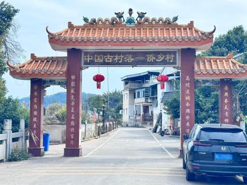

# 侨乡村

## 景点图片

> 图片来源：[高德地图](https://www.amap.com/search?query=侨乡村)

## 基本信息

| 项目 | 内容 |
|------|------|
| 景点名称 | 侨乡村 |
| 所在城市 | 梅州市 |
| 所在区县 | 梅县区 |
| 景点级别 | - |
| 景点类型 | 历史文化村落 |
| 开放时间 | 全天开放（部分民居参观时间另计） |
| 门票价格 | 以现场公示为准 |

## 景点介绍

侨乡村位于梅州市梅县区，是以侨乡文化与客家传统民居为特色的历史文化村落。村中保存有多座围龙屋、碉楼和中西合璧式民居，反映了近代梅州华侨出洋谋生、回乡置业所形成的独特建筑与社会面貌。

漫步侨乡村，可见传统客家聚落格局与侨批文化、侨居建筑相互交融。这里既适合参观历史建筑，也适合了解梅州作为著名侨乡的历史脉络，是体验客家侨乡文化的重要节点。

## 景点特点

- 以侨乡文化与客家民居为特色
- 可见围龙屋、碉楼及中西合璧建筑
- 反映华侨回乡置业的历史面貌
- 适合建筑参观与侨乡文化体验

## 位置

- **地址**：梅州市梅县区（205国道与026县道交叉口附近）
- **经纬度**：24.2730°N, 115.9789°E

## 交通

- **自驾**：导航至“侨乡村”
- **公交**：可先至梅县区相关镇街，再转乘当地交通前往

## 数据来源

- [百度百科-侨乡村](https://baike.baidu.com/item/%E4%BE%A8%E4%B9%A1%E6%9D%91)

## 最后更新时间

2026-07-17
