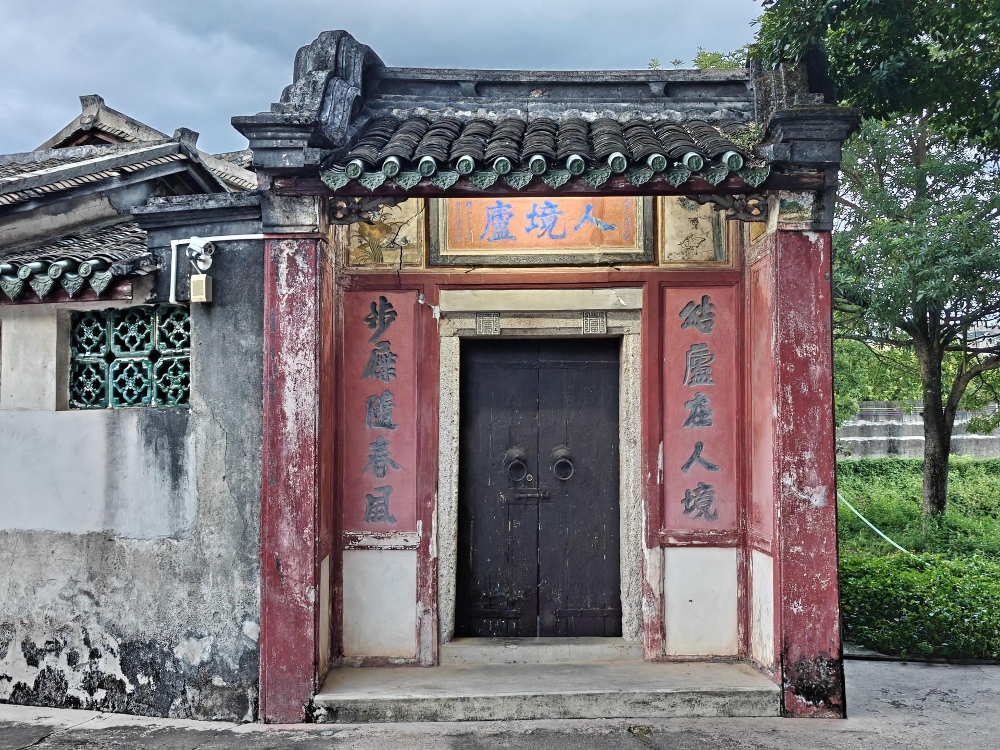

# 人境庐

## 景点图片

> 图片来源：[高德地图](https://www.amap.com/search?query=人境庐)

## 基本信息

| 项目 | 内容 |
|------|------|
| 景点名称 | 人境庐 |
| 所在城市 | 梅州市 |
| 所在区县 | 梅江区 |
| 景点级别 | 全国重点文物保护单位 |
| 景点类型 | 历史建筑 |
| 开放时间 | 08:30-17:30 |
| 门票价格 | 与黄遵宪纪念馆联票，以现场公示为准 |

## 景点介绍

人境庐位于梅州市梅江区，是晚清著名诗人、外交家黄遵宪的故居，也是全国重点文物保护单位。人境庐建于1884年，取陶渊明“结庐在人境，而无车马喧”之意命名，是黄遵宪晚年归乡后读书、会客和创作的重要场所。

故居为客家传统民居与中西合璧元素相结合的建筑，院落清幽，保存有黄遵宪手迹、诗文及相关史料陈列。人境庐与相邻的黄遵宪纪念馆、荣禄第共同构成了解黄遵宪生平与客家人文传统的核心参观区域，是梅州最具代表性的历史文化景点之一。

## 景点特点

- 全国重点文物保护单位，黄遵宪故居
- 取陶渊明诗意命名，体现归隐与济世并存的文人精神
- 保存黄遵宪手迹、诗文及相关史料
- 与黄遵宪纪念馆、荣禄第相邻，便于串联参观
- 梅州重要的客家人文地标

## 位置

- **地址**：梅州市梅江区小溪唇江边路A17号
- **经纬度**：24.3108°N, 116.1301°E

## 交通

- **公交**：可乘坐梅州市区公交至东山大道、客家公园附近站点后步行前往
- **自驾**：导航至“人境庐”或“黄遵宪纪念馆”，周边可停车

## 数据来源

- [百度百科-人境庐](https://baike.baidu.com/item/%E4%BA%BA%E5%A2%83%E5%BA%90)

## 最后更新时间

2026-07-17
