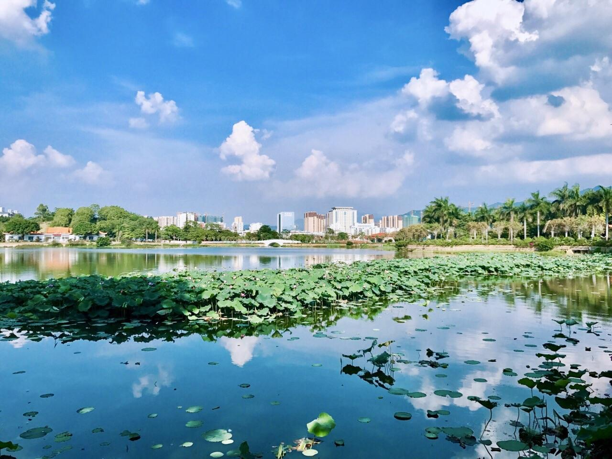

# 剑英公园

## 景点图片

> 图片来源：[携程攻略](https://you.ctrip.com/sight/523/131408.html)

## 基本信息

| 项目 | 内容 |
|------|------|
| 景点名称 | 剑英公园 |
| 所在城市 | 梅州市 |
| 所在区县 | 梅江区 |
| 景点级别 | - |
| 景点类型 | 城市公园 |
| 开放时间 | 全天开放 |
| 门票价格 | 免费 |

## 景点介绍

剑英公园位于梅州市梅江区华南大道，是以无产阶级革命家叶剑英元帅命名的城市综合性公园。公园绿化良好，园路完善，设有广场、湖面、健身与休闲设施，是梅城居民日常休闲和游客停留休憩的重要场所。

公园既体现城市公共绿地功能，也承载着纪念叶剑英元帅的地方文化意义，常与叶剑英纪念园等红色景点共同构成梅州红色文化参观线路中的城市节点。

## 景点特点

- 以叶剑英元帅命名的城市综合公园
- 免费开放，适合休闲散步与亲子活动
- 绿化完善，配套设施齐全
- 可与叶剑英纪念园等红色景点串联游览

## 位置

- **地址**：梅州市梅江区华南大道18号
- **经纬度**：24.2723°N, 116.1227°E

## 交通

- **公交**：可乘坐市区公交至华南大道、剑英公园附近站点
- **自驾**：导航至“剑英公园”

## 数据来源

- [百度百科-剑英公园](https://baike.baidu.com/item/%E5%89%91%E8%8B%B1%E5%85%AC%E5%9B%AD)
- [携程攻略-剑英公园](https://you.ctrip.com/sight/523/131408.html)

## 最后更新时间

2026-07-17
