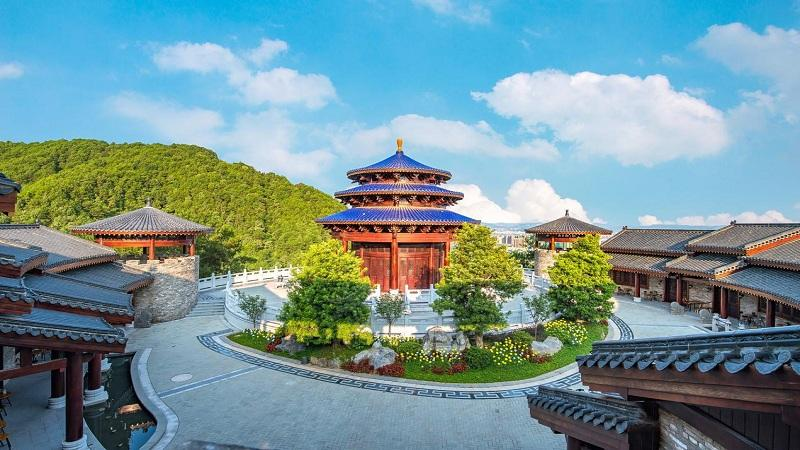

# 客天下旅游产业园

## 景点图片

> 图片来源：[携程攻略](https://you.ctrip.com/sight/meizhou523/136131.html)

## 基本信息

| 项目 | 内容 |
|------|------|
| 景点名称 | 客天下旅游产业园 |
| 所在城市 | 梅州市 |
| 所在区县 | 梅江区 |
| 景点级别 | 4A |
| 景点类型 | 主题公园 |
| 开放时间 | 09:00-18:00（周一至周日） |
| 门票价格 | 约80元 |

## 景点介绍

客天下旅游产业园位于梅州市梅江区，是一个集客家文化体验、休闲旅游、生态观光于一体的大型综合性旅游景区。园区以客家文化为核心，融合了客家围龙屋建筑、客家民俗表演、客家美食品鉴等多种元素，是了解客家文化的重要窗口。

景区内建有客天下广场、客家小镇、圣山国际、客家印象等特色景点，通过现代科技手段与传统文化的结合，为游客呈现了一个立体的客家文化世界。园区环境优美，山水相依，四季皆宜游览。

## 景点特点

- 以客家文化为主题的大型综合旅游园区
- 客家小镇完整再现传统客家建筑风貌
- 丰富的客家民俗文化表演和互动体验
- 园区生态环境优美，适合家庭亲子游

## 位置

- **地址**：梅州市梅江区三角镇
- **经纬度**：24.2634°N, 116.1504°E

## 交通

- **地铁**：暂无地铁
- **公交**：可乘坐梅州市区公交车至客天下站下车
- **自驾**：导航至"客天下旅游产业园"，景区设有停车场

## 数据来源

- [百度百科-客天下](https://baike.baidu.com/item/%E5%AE%A2%E5%A4%A9%E4%B8%8B)
- [携程攻略-客天下旅游产业园](https://you.ctrip.com/sight/meizhou523/136131.html)

## 最后更新时间

2026-07-17
