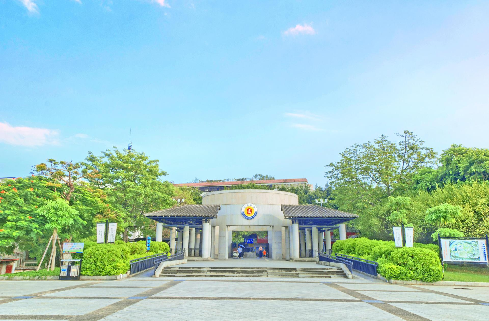

# 客家公园

## 景点图片

> 图片来源：[携程攻略](https://you.ctrip.com/sight/523/51316.html)

## 基本信息

| 项目 | 内容 |
|------|------|
| 景点名称 | 客家公园 |
| 所在城市 | 梅州市 |
| 所在区县 | 梅江区 |
| 景点级别 | - |
| 景点类型 | 城市公园 / 历史文化景区 |
| 开放时间 | 全天开放（园内展馆时间另计） |
| 门票价格 | 公园免费，部分展馆另计 |

## 景点介绍

客家公园位于梅州市梅江区东山大道，是集历史文化展示、城市休闲和滨江景观于一体的综合性公园。园内汇聚人境庐、黄遵宪纪念馆、中国客家博物馆等重要文化场所，是认识梅州客家文化的核心区域。

公园环境清幽，绿树成荫，适合市民晨练、散步，也适合游客串联参观周边文博景点和历史建筑。作为梅城标志性公共文化空间，客家公园承担着展示客家人文、服务市民休闲的双重功能。

## 景点特点

- 汇聚人境庐、黄遵宪纪念馆、中国客家博物馆等文化地标
- 兼具城市公园与历史文化景区功能
- 滨江环境优美，适合休闲散步
- 是了解梅州客家文化的核心区域

## 位置

- **地址**：梅州市梅江区东山大道2号
- **经纬度**：24.3107°N, 116.1326°E

## 交通

- **公交**：可乘坐市区公交至客家公园、东山大道附近站点
- **自驾**：导航至“客家公园”

## 数据来源

- [百度百科-客家公园](https://baike.baidu.com/item/%E5%AE%A2%E5%AE%B6%E5%85%AC%E5%9B%AD)
- [携程攻略-客家公园](https://you.ctrip.com/sight/523/51316.html)

## 最后更新时间

2026-07-17
