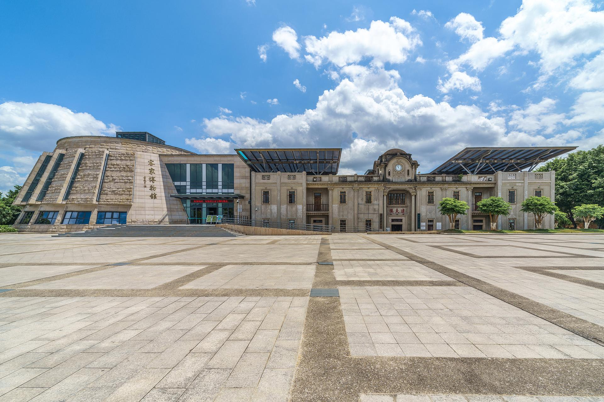

# 梅州客家博物馆

## 景点图片

> 图片来源：[携程攻略](https://you.ctrip.com/sight/meizhou523/1835425.html)

## 基本信息

| 项目 | 内容 |
|------|------|
| 景点名称 | 梅州客家博物馆 |
| 所在城市 | 梅州市 |
| 所在区县 | 梅江区 |
| 景点级别 | 国家二级博物馆 |
| 景点类型 | 博物馆 |
| 开放时间 | 09:00-17:00（周一闭馆） |
| 门票价格 | 免费 |

## 景点介绍

梅州客家博物馆位于梅州市梅江区，是国家二级博物馆，也是中国最大的客家博物馆之一。博物馆占地面积约1.2万平方米，馆内收藏和展示了客家文化的历史文物和民俗资料。

梅州客家博物馆设有客家文化展厅、客家历史展厅、客家民俗展厅等多个主题展区。馆内展示了客家人的迁徙历史、建筑文化、饮食文化、服饰文化等，全面反映了客家文化的博大精深。

梅州客家博物馆是了解客家文化的重要窗口，也是梅州市重要的文化设施和旅游景点。

## 景点特点

- **国家二级博物馆**：中国最大的客家博物馆之一
- **客家文化展示**：全面反映客家文化的博大精深
- **多个主题展区**：客家文化、历史、民俗等
- **免费开放**：可自由参观
- **科普教育**：了解客家文化的重要窗口

## 位置

- **地址**：梅州市梅江区梅州客家博物馆
- **经纬度**：24.2801°N, 116.119°E

## 交通

- **公交**：梅州市内多路公交可达
- **自驾**：可停放至博物馆停车场

## 数据来源

- [百度百科-中国客家博物馆](https://baike.baidu.com/item/%E4%B8%AD%E5%9B%BD%E5%AE%A2%E5%AE%B6%E5%8D%9A%E7%89%A9%E9%A6%86)
- [携程攻略-梅州客家博物馆](https://you.ctrip.com/sight/meizhou523/1835425.html)

## 最后更新时间

2026-07-17
