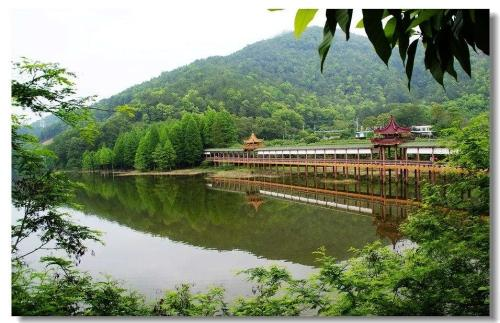

# 泮坑风景区

## 景点图片

> 图片来源：[高德地图](https://www.amap.com/search?query=泮坑风景区)

## 基本信息

| 项目 | 内容 |
|------|------|
| 景点名称 | 泮坑风景区 |
| 所在城市 | 梅州市 |
| 所在区县 | 梅江区 |
| 景点级别 | - |
| 景点类型 | 自然风景区 |
| 开放时间 | 全天开放（以现场管理为准） |
| 门票价格 | 免费或低收费，以现场公示为准 |

## 景点介绍

泮坑风景区位于梅州市梅江区三角镇，是梅城近郊著名的自然山水景区。景区内山峦叠翠、溪水清澈，尤以水杉林、湖光倒影和山林步道著称，是市民周末徒步、摄影和亲近自然的热门去处。

泮坑既保留了客家近郊山水的清幽气质，也因季节景色变化而具有较高的观赏价值。春夏葱茏、秋冬水杉色叶与水面倒影相映，是体验梅州城市周边生态休闲的重要选择。

## 景点特点

- 梅城近郊山水休闲地
- 水杉林与湖光倒影景色突出
- 适合徒步、摄影和家庭出游
- 距市区较近，交通便利

## 位置

- **地址**：梅州市梅江区三角镇泮坑村
- **经纬度**：24.2450°N, 116.1398°E

## 交通

- **公交**：可先至三角镇方向再转乘当地交通前往泮坑村
- **自驾**：导航至“泮坑风景区”或“泮坑村”

## 数据来源

- [百度百科-泮坑](https://baike.baidu.com/item/%E6%B3%AE%E5%9D%91)

## 最后更新时间

2026-07-17
