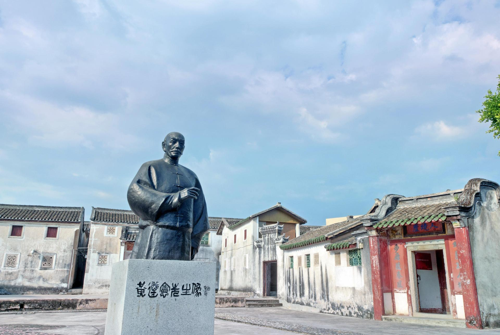

# 黄遵宪纪念馆

## 景点图片

> 图片来源：[携程攻略](https://you.ctrip.com/sight/523/17683.html)

## 基本信息

| 项目 | 内容 |
|------|------|
| 景点名称 | 黄遵宪纪念馆 |
| 所在城市 | 梅州市 |
| 所在区县 | 梅江区 |
| 景点级别 | 全国重点文物保护单位（人境庐）相关展馆 |
| 景点类型 | 纪念馆 |
| 开放时间 | 08:30-17:30 |
| 门票价格 | 以现场公示为准 |

## 景点介绍

黄遵宪纪念馆位于梅州市梅江区客家公园内，依托黄遵宪故居人境庐及周边历史建筑设立，是系统展示黄遵宪生平、外交成就与诗文创作的专题纪念馆。

馆区常设展陈围绕黄遵宪“诗界革命”主张、出使海外经历及其对近代中国思想文化的影响展开，并与人境庐、荣禄第等历史建筑形成联动参观路线。作为梅州城市历史文化核心区的重要组成部分，黄遵宪纪念馆也是了解客家先贤与近代中国互动关系的重要窗口。

## 景点特点

- 专题展示黄遵宪生平与诗文成就
- 与人境庐、荣禄第联动参观
- 位于客家公园历史文化核心区
- 兼具文物保护与公共文化教育功能

## 位置

- **地址**：梅州市梅江区东山大道2号客家公园内
- **经纬度**：24.3109°N, 116.1301°E

## 交通

- **公交**：可乘坐梅州市区公交至客家公园、东山大道沿线站点
- **自驾**：导航至“黄遵宪纪念馆”或“客家公园”

## 数据来源

- [百度百科-黄遵宪纪念馆](https://baike.baidu.com/item/%E9%BB%84%E9%81%B5%E5%AE%AA%E7%BA%AA%E5%BF%B5%E9%A6%86)
- [携程攻略-黄遵宪纪念馆](https://you.ctrip.com/sight/523/17683.html)

## 最后更新时间

2026-07-17
