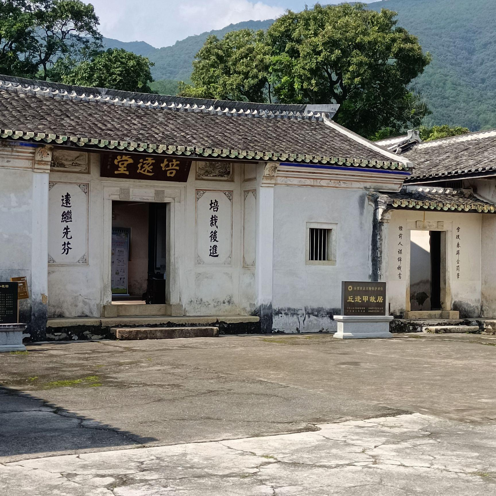

# 丘逢甲故居

## 景点图片

> 图片来源：[高德地图](https://www.amap.com/search?query=丘逢甲故居)

## 基本信息

| 项目 | 内容 |
|------|------|
| 景点名称 | 丘逢甲故居 |
| 所在城市 | 梅州市 |
| 所在区县 | 蕉岭县 |
| 景点级别 | 全国重点文物保护单位 |
| 景点类型 | 历史建筑 / 名人故居 |
| 开放时间 | 08:30-17:30 |
| 门票价格 | 免费或低收费，以现场公示为准 |

## 景点介绍

丘逢甲故居位于梅州市蕉岭县文福镇，是近代爱国志士、教育家和诗人丘逢甲的故里建筑，属全国重点文物保护单位。故居保存了客家传统民居格局，并设有相关史迹陈列，展现丘逢甲的生平事迹及其在近代中国历史中的影响。

参观故居，不仅可以了解丘逢甲“春愁难遣强看山”等诗文背后的家国情怀，也能感受蕉岭客家乡村的历史人文氛围。这里是粤东地区重要的名人史迹点，也是开展爱国主义教育和历史文化研学的重要场所。

## 景点特点

- 全国重点文物保护单位
- 近代爱国志士丘逢甲故里
- 保存客家传统民居风貌
- 兼具文物保护与爱国主义教育功能

## 位置

- **地址**：梅州市蕉岭县文福镇
- **经纬度**：24.7379°N, 116.1664°E

## 交通

- **自驾**：从蕉岭县城沿文福镇方向行驶，导航至“丘逢甲故居”
- **公交**：可先至蕉岭县城，再转乘前往文福镇的班车或出租车

## 数据来源

- [百度百科-丘逢甲故居](https://baike.baidu.com/item/%E4%B8%98%E9%80%A2%E7%94%B2%E6%95%85%E5%B1%85)

## 最后更新时间

2026-07-17
