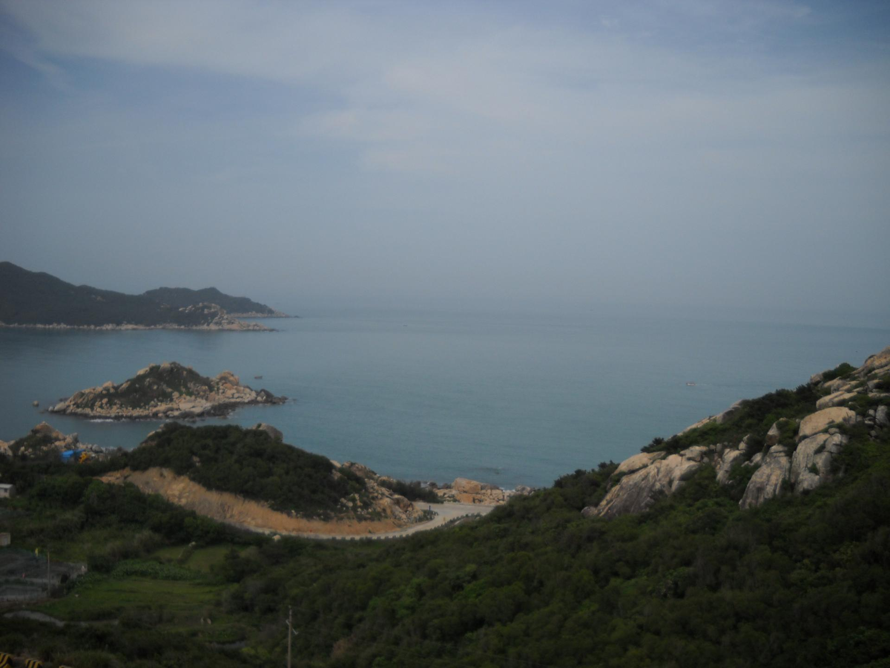

# 青澳湾

## 景点图片

> 图片来源：[Wikimedia Commons](https://commons.wikimedia.org/wiki/File%3A%E9%9D%92%E6%BE%B3%E6%B9%BE_-_panoramio.jpg) · 许可证：CC BY-SA 4.0

## 基本信息

| 项目 | 详情 |
|------|------|
| 景点名称 | 青澳湾 |
| 所在地区 | 汕头市南澳县 |
| 景点类型 | 海滨 |
| 景点等级 | 未评级（著名海滨浴场） |
| 开放时间 | 全天开放 |
| 门票价格 | 免费 |
| 建议游玩时间 | 半天至一天 |
| 适合人群 | 家庭出游、情侣、海滨爱好者 |

## 景点介绍

青澳湾位于南澳岛东端，是粤东地区最著名的海滨浴场之一。青澳湾以其清澈的海水、细腻的沙滩和优美的自然环境而闻名，被誉为"东方夏威夷"。海湾呈弧形，沙滩长约2公里，沙质洁白细腻，海水清澈见底，是游泳、冲浪、日光浴的理想场所。湾内风浪较小，适合各类海上活动。

## 景点特点

- 海水清澈，沙滩细腻洁白
- 海湾弧形优美，风景如画
- 风浪较小，适合游泳和水上活动
- 日出日落景色绝美
- 海鲜美食丰富
- 自然生态环境优良

## 位置

广东省汕头市南澳县东端，距南澳县城约15公里。

## 交通

- **自驾**：从南澳县城沿环岛公路行驶至青澳湾
- **公交**：可乘坐南澳县内公交至青澳湾站
- **包车**：可从汕头市区或南澳县城包车前往
- **旅游专线**：部分旅游专线车可达

## 数据来源

- 汕头市文化广电旅游体育局
- 南澳县人民政府官网
- 各大旅游平台公开信息

## 最后更新时间

2026-06-20
