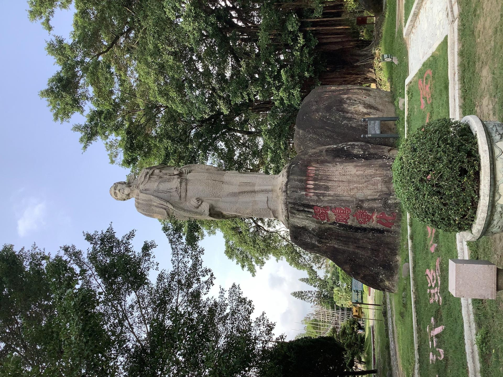

# 莲花峰风景区

## 景点图片

> 图片来源：[Wikimedia Commons](https://commons.wikimedia.org/wiki/File:%E8%8E%B2%E8%8A%B1%E5%B3%B0%E6%96%87%E5%A4%A9%E7%A5%A5%E5%83%8F.jpg) · 许可证：CC BY-SA 4.0

## 基本信息

| 项目 | 内容 |
|------|------|
| 景点名称 | 莲花峰风景区 |
| 所在城市 | 汕头市 |
| 所在区县 | 潮阳区 |
| 景点级别 | 4A级景区 |
| 景点类型 | 自然风景区 |
| 开放时间 | 08:00-18:00（全年开放） |
| 门票价格 | 待确认 |

## 景点介绍

莲花峰风景区位于广东省汕头市潮阳区海门镇，因主峰状如莲花而得名，是粤东著名的自然风景区。景区依山傍海，集自然风光与历史文化于一体，是潮阳乃至汕头地区的重要旅游目的地。

景区内主要景点有莲花峰、古炮台、莲花书院等。莲花峰山体由花岗岩构成，主峰岩石层层叠叠，形似盛开的莲花，气势雄伟。古炮台见证了海门地区抵御外敌的历史，莲花书院则是传承潮汕文化的重要场所。景区兼具山海风光，登高远眺可欣赏浩瀚的南海景色。

## 景点特点

- **莲花奇峰**：主峰由花岗岩构成，状如莲花盛开，造型独特，为天然地质奇观
- **山海风光**：依山傍海，兼具山林与海滨风光，景色壮美
- **历史古迹**：古炮台等历史遗迹承载着海门地区的海防历史
- **文化底蕴**：莲花书院等文化场所传承潮汕文脉，文化氛围浓厚
- **海门风情**：毗邻海门渔港，可感受浓郁的潮汕渔港风情

## 位置

- **地址**：广东省汕头市潮阳区海门镇莲花峰风景区
- **经纬度**：23.1980°N, 116.6120°E

## 交通

- **高铁**：汕头站下车后转乘公交或出租车前往，车程约1小时
- **公交**：潮阳城区乘坐前往海门镇的公交车，在莲花峰站下车
- **自驾**：经沈海高速（G15）潮阳出口下，沿S234省道行驶至海门镇莲花峰风景区

## 数据来源

- [汕头市文化广电旅游体育局](http://whly.st.gov.cn/)

## 最后更新时间

2026-06-25
