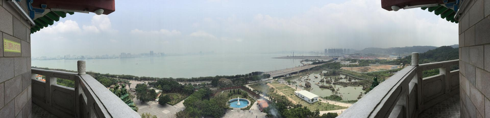

# 塔山风景区

## 景点图片

> 图片来源：[Wikimedia Commons](https://commons.wikimedia.org/wiki/File:%E5%A1%94%E9%A1%B6%E9%B8%9F%E7%9E%B0%E6%B1%95%E5%A4%B4%E5%85%A8%E6%99%AF.jpg) · 许可证：CC BY-SA 4.0

## 基本信息

| 项目 | 内容 |
|------|------|
| 景点名称 | 塔山风景区 |
| 所在城市 | 汕头市 |
| 所在区县 | 澄海区 |
| 景点级别 | 无 |
| 景点类型 | 宗教文化景区 |
| 开放时间 | 08:00-18:00（周一至周日） |
| 门票价格 | 免费 |

## 景点介绍

塔山风景区位于汕头市澄海区，因山上有一座始建于宋代的古塔而得名。景区以宗教文化和自然风光为主题，有塔山寺、古塔、观海亭等景点。

塔山海拔约200米，登山可俯瞰澄海城区与周边风光。山上的塔山寺始建于宋代，是潮汕地区重要的佛教活动场所。每逢佛教节日，前来朝拜的信众络绎不绝。

## 景点特点

- **历史悠久**：古塔始建于宋代，有近千年历史
- **宗教文化**：塔山寺是潮汕地区重要的佛教活动场所
- **自然风光**：登山可俯瞰澄海城区与周边风光
- **免费开放**：景区免费开放，是市民休闲的好去处

## 位置

- **地址**：汕头市澄海区塔山风景区
- **经纬度**：23.5302°N, 116.7805°E

## 交通

- **公交**：汕头市区或澄海城区乘坐公交至塔山风景区
- **自驾**：导航至“澄海塔山风景区”

## 数据来源

- [澎湃新闻-汕头旅游必去十大景点](https://m.thepaper.cn/newsDetail_forward_28702678)
- [汕头市人民政府](https://www.shantou.gov.cn/)

## 最后更新时间

2026-07-18
