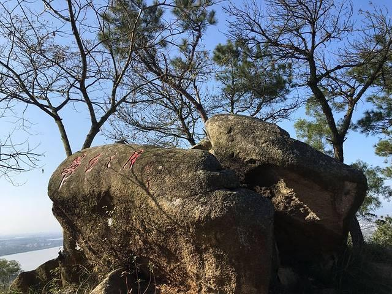

# 程洋岗古村落

## 景点图片

> 图片来源：[去哪儿旅行](https://img1.qunarzz.com/travel/poi/1712/48/f019128487133937.jpg_r_640x480x70_f6432d81.jpg)

## 景点介绍

程洋岗古村落位于汕头市澄海区莲下镇，是广东省省级古村落，有着悠久的历史和丰富的文化遗产。程洋岗始建于宋代，村内保存了大量明清时期的潮汕传统民居建筑，包括祠堂、庙宇、古井、古巷等。村落布局完整，建筑风格独特，体现了潮汕传统村落的风水格局和建筑艺术。村内居民保留着传统的生活方式，是体验潮汕乡村文化和传统民俗的好去处。

## 景点特点

- 省级古村落，始建于宋代，历史悠久
- 保存大量明清时期潮汕传统民居建筑
- 祠堂、庙宇、古井、古巷等历史遗存丰富
- 村落布局完整，体现传统风水格局
- 传统文化氛围浓厚，体验潮汕乡村生活

## 位置

- **地址**：汕头市澄海区莲下镇程洋岗村
- **经纬度**：23.5262°N, 116.7566°E

## 交通

- **高铁/火车**：乘坐高铁至潮汕站或汕头站
- **公交**：汕头市区乘坐公交至澄海区莲下镇，转乘当地交通工具
- **自驾**：导航至"程洋岗村"，经汕汾高速或国道G324可达

## 数据来源

- [百度百科-程洋岗](https://wapbaike.baidu.com/item/%E7%A8%8B%E6%B4%8B%E5%86%88/1256087)
- [汕头市人民政府](https://www.shantou.gov.cn/)

## 最后更新时间

2026-07-19

