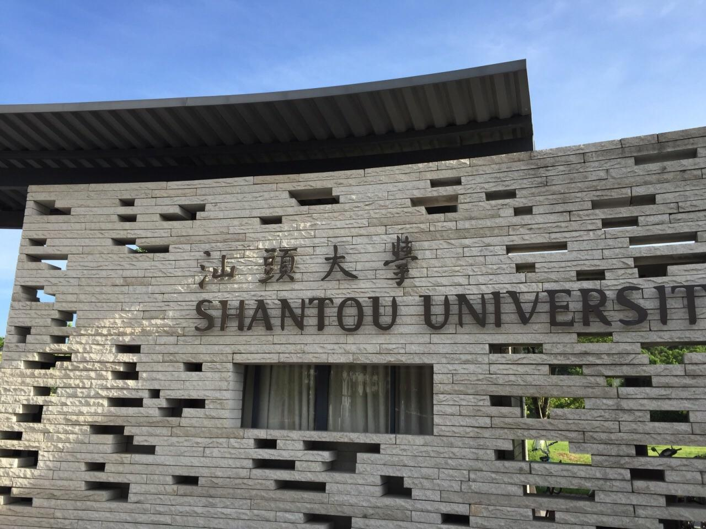

# 汕头大学

## 景点图片

> 图片来源：[携程攻略](https://youimg1.c-ctrip.com/target/100k0u000000j8rsx12C8.jpg)

## 景点介绍

汕头大学位于汕头市金平区大学路，是1981年经国务院批准成立的广东省属综合性大学，是教育部、广东省、李嘉诚基金会三方共建的大学。汕头大学校园由李嘉诚先生捐资兴建，校园建筑风格现代独特，被誉为"中国最美大学校园"之一。校园内有真理钟、图书馆、医学院大楼等标志性建筑，其中图书馆由著名建筑师陈瑞宪设计，环境优美，学术氛围浓厚。汕头大学不仅是一所高等学府，其现代化的校园建筑和优美的环境也吸引着众多游客前来参观。

## 景点特点

- 李嘉诚基金会捐资兴建的现代化大学
- 被誉为"中国最美大学校园"之一
- 校园建筑风格现代独特，设计感强
- 真理钟、图书馆等标志性建筑
- 学术氛围浓厚，环境优美

## 位置

- **地址**：汕头市金平区大学路243号
- **经纬度**：23.4084°N, 116.6369°E

## 交通

- **高铁/火车**：乘坐高铁至汕头站
- **公交**：汕头市区乘坐多路公交至汕头大学站
- **自驾**：导航至"汕头大学"，经大学路直达

## 数据来源

- [汕头大学官网](https://www.stu.edu.cn/)
- [百度百科-汕头大学](https://wapbaike.baidu.com/item/%E6%B1%95%E5%A4%B4%E5%A4%A7%E5%AD%A6)

## 最后更新时间

2026-07-19

