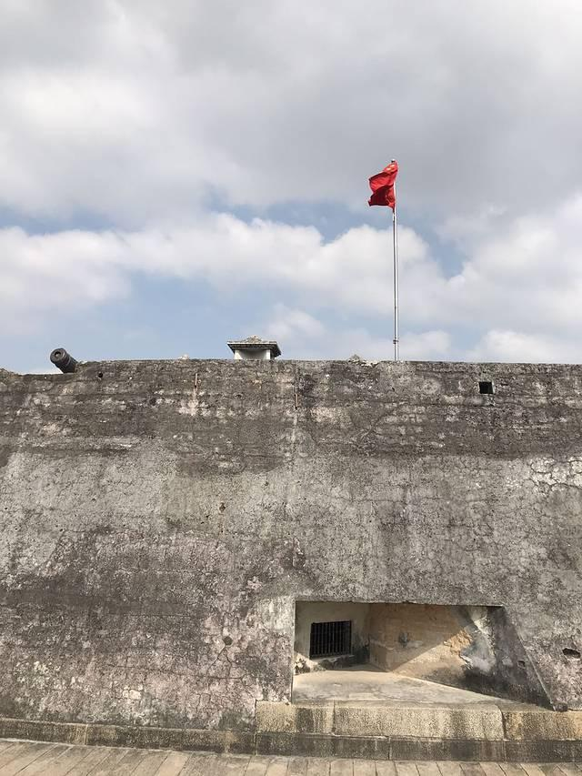

# 石炮台公园

## 景点图片

> 图片来源：[去哪儿旅行](https://tr-osdcp.qunarzz.com/tr-osd-tr-space/img/eeec59b7266f1d71b15f44d98186d93a.jpg_r_640x853x70_41cb78e6.jpg)

## 景点介绍

石炮台公园位于汕头市金平区海滨路20号，是以清代崎碌炮台为核心景观的纪念性公园。炮台始建于1874年，历时约五年建成，采用贝灰砂、糯米浆与红糖夯筑，花岗岩砌筑炮巷，结构坚固，设有双层炮位、护台河及通风设施，是清末粤东重要海防工程。公园前身与近代军事、监狱等历史阶段相关，1983年后逐步改建为公园，现为全国重点文物保护单位和爱国主义教育基地。园区保留环形城堡、点将台、护台河等遗迹，并设有海防历史展示内容，兼具国防教育与城市绿地功能。

## 景点特点

- 全国重点文物保护单位，海防历史价值突出
- 保留清代崎碌炮台主体格局与护台河等遗迹
- 爱国主义教育基地，适合研学与历史参观
- 位于海滨路，可与海滨长廊串联游览
- 免费开放，兼具纪念性公园与城市休闲功能

## 位置

- **地址**：汕头市金平区海滨路20号
- **经纬度**：23.3520°N, 116.6989°E

## 交通

- **公交**：可乘坐19路、103路等途经海滨路的公交至石炮台附近站点
- **自驾**：导航至“石炮台公园”或“崎碌炮台”
- **步行**：沿海滨长廊步行即可抵达

## 数据来源

- [百度百科-石炮台公园](https://wapbaike.baidu.com/item/%E7%9F%B3%E7%82%AE%E5%8F%B0%E5%85%AC%E5%9B%AD)
- [汕头市人民政府](https://www.shantou.gov.cn/)

## 最后更新时间

2026-07-19

