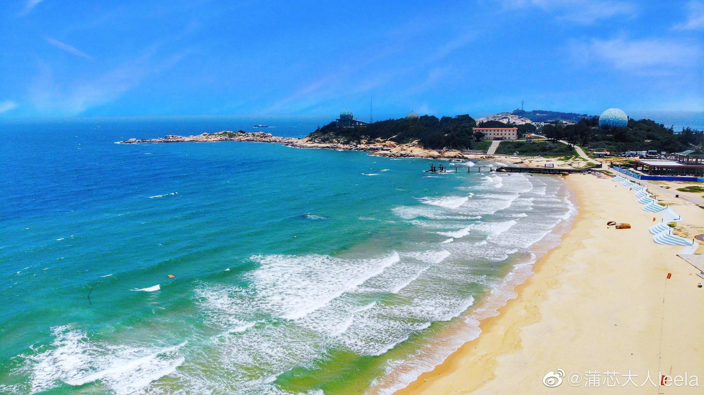

# 汕尾长沙湾

## 景点图片

> 图片来源：[新浪网](https://n.sinaimg.cn/sinakd20122/799/w2048h1151/20200521/e01d-itvqccc4433277.jpg)

## 景点特点

- 绵长海岸线，沙滩平缓宽阔
- 红树林湿地生态景观丰富
- 候鸟栖息地，观鸟爱好者的理想去处
- 滨海步道适合散步骑行
- 日落景色壮美，摄影胜地

## 位置

- **地址**：汕尾市城区长沙湾
- **经纬度**：22.8391°N, 115.285°E

## 交通

- **高铁/火车**：乘坐厦深高铁至汕尾站，转乘公交至长沙湾附近
- **公交**：汕尾市区乘坐公交可至长沙湾附近
- **自驾**：导航至"长沙湾"即可

## 数据来源

- [百度百科-长沙湾](https://baike.baidu.com/item/%E9%95%BF%E6%B2%99%E6%B9%BE)

## 最后更新时间

2026-07-19
