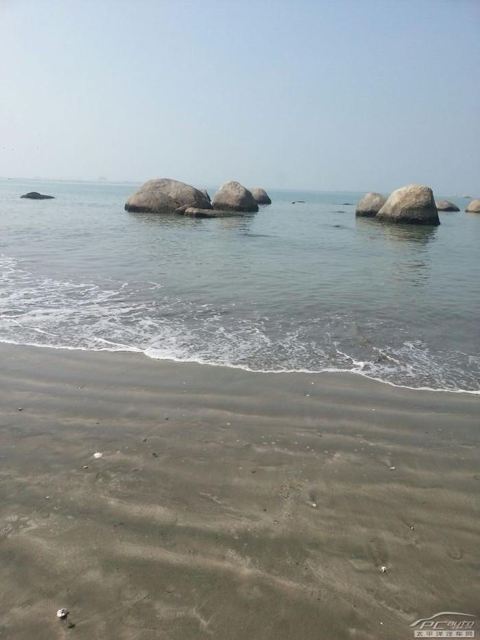

# 金厢银滩

## 景点图片

> 图片来源：[百度百科](https://bkimg.cdn.bcebos.com/pic/ca1349540923dd54564eb28fb843a4de9c82d058e288?x-bce-process=image/format,f_auto/resize,m_lfit,limit_1,h_1000)

## 基本信息

| 项目 | 内容 |
|------|------|
| 景点名称 | 金厢银滩 |
| 所在城市 | 汕尾市 |
| 所在区县 | 陆丰市 |
| 景点级别 | 无 |
| 景点类型 | 滨海旅游区 |
| 开放时间 | 全天开放 |
| 门票价格 | 免费 |

## 景点介绍

金厢银滩位于汕尾市陆丰市金厢镇，是一处天然的海滨沙滩。全长约12公里，沙质细腻洁白，海水清澈碧蓝，被誉为"粤东明珠"。

金厢银滩以原始自然风貌著称，沙滩背靠青山，面朝大海，景色优美。这里游客相对较少，保持着原始的自然风貌，是远离城市喧嚣、享受宁静海滨时光的理想去处。

## 景点特点

- **沙滩优美**：全长约12公里，沙质细腻洁白
- **海水清澈**：海水碧蓝清澈，适合游泳和戏水
- **原始风貌**：保持原始自然风貌，游客相对较少
- **免费开放**：景区免费开放

## 位置

- **地址**：汕尾市陆丰市金厢镇
- **经纬度**：22.8581°N, 115.7095°E

## 交通

- **自驾**：沈海高速陆丰出口下，沿海边方向行驶约30分钟
- **包车**：从陆丰市区包车前往约40分钟

## 数据来源

- [百度百科-汕尾市](https://baike.baidu.com/item/%E6%B1%95%E5%B0%BE%E5%B8%82)

## 最后更新时间

2026-07-19

