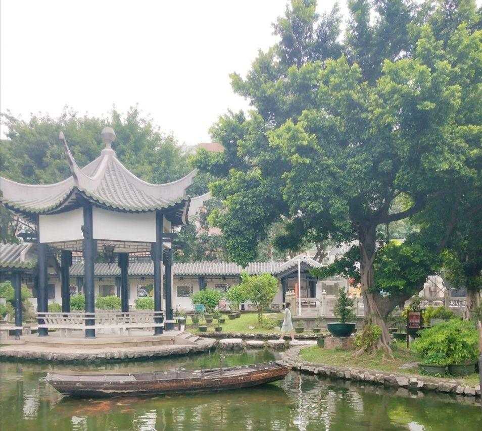

# 陈少白故居

## 景点图片

> 图片来源：[携程攻略](https://youimg1.c-ctrip.com/target/100d0w000000kb5at43ED.jpg)

## 景点介绍

陈少白故居位于广东省江门市江海区外海街道南山路村（陈坑村），是辛亥革命先驱、同盟会 founding member 陈少白（1869-1933）的出生地和故居。陈少白原名陈衍鸿，字竹云，号少白，与新会人区根（区谔良）、香山如何香凝并称为"岭南三杰"，与孙中山、陆皓东、杨衢云并称"辛亥革命四杰"。

故居建于清光绪年间，为砖木结构建筑，坐北向南，三间两廊，硬山顶，面阔三间，进深两间，建筑面积约300平方米，是典型的岭南传统民居。2003年被公布为广东省文物保护单位。

故居内展示了陈少白的生平事迹、革命活动和相关历史资料，是了解辛亥革命历史和五邑侨乡文化的重要窗口。

## 景点特点

- **广东省文物保护单位**：2003年列入广东省文物保护单位名单
- **辛亥革命先驱故居**："辛亥革命四杰"之一陈少白的出生地
- **同盟会成员**：中国同盟会早期重要成员
- **岭南传统建筑**：清光绪年间建造的砖木结构民居
- **革命遗址**：见证了中国近代革命历史的重要场所
- **免费开放**：向社会公众免费开放

## 位置

- **地址**：广东省江门市江海区外海街道南山路村
- **经纬度**：22.5887°N, 113.148°E

## 交通

- **公交**：从江门市区乘坐公交至外海街道，再步行前往
- **自驾**：从江门市区沿江沙东路行驶，经外海大桥到达外海街道，按指示牌前往

## 数据来源

- [陈少白故居 - 百度百科](https://baike.baidu.com/item/%E9%99%88%E5%B0%91%E7%99%BD%E6%95%85%E5%B1%85/10467826)

## 最后更新时间

2026-07-19

