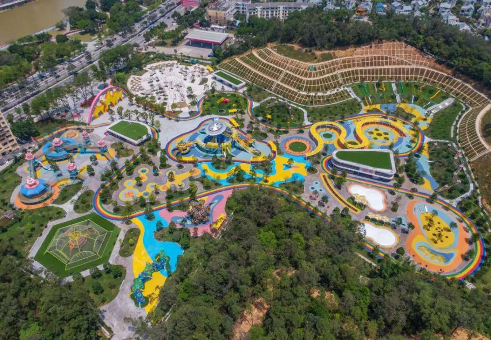

# 江门动物园

## 景点图片

> 图片来源：[新浪网](http://n.sinaimg.cn/sinakd20240109s/230/w1080h750/20240109/67ff-ebd72ffdfb6e862703c6102c10b6938a.jpg)

## 景点特点

- **江门市唯一的动物园**：占地面积约15公顷
- **80多种动物**：老虎、狮子、黑熊、猴子等
- **儿童乐园**：适合亲子游
- **票价亲民**：约30元/人
- **科普教育**：江门市重要的科普教育基地

## 位置

- **地址**：江门市蓬江区江门动物园
- **经纬度**：22.7557°N, 112.9491°E

## 交通

- **公交**：江门市内多路公交可达
- **自驾**：可停放至动物园停车场

## 数据来源

- [百度百科-江门动物园](https://baike.baidu.com/item/江门动物园)

## 最后更新时间

2026-07-19
