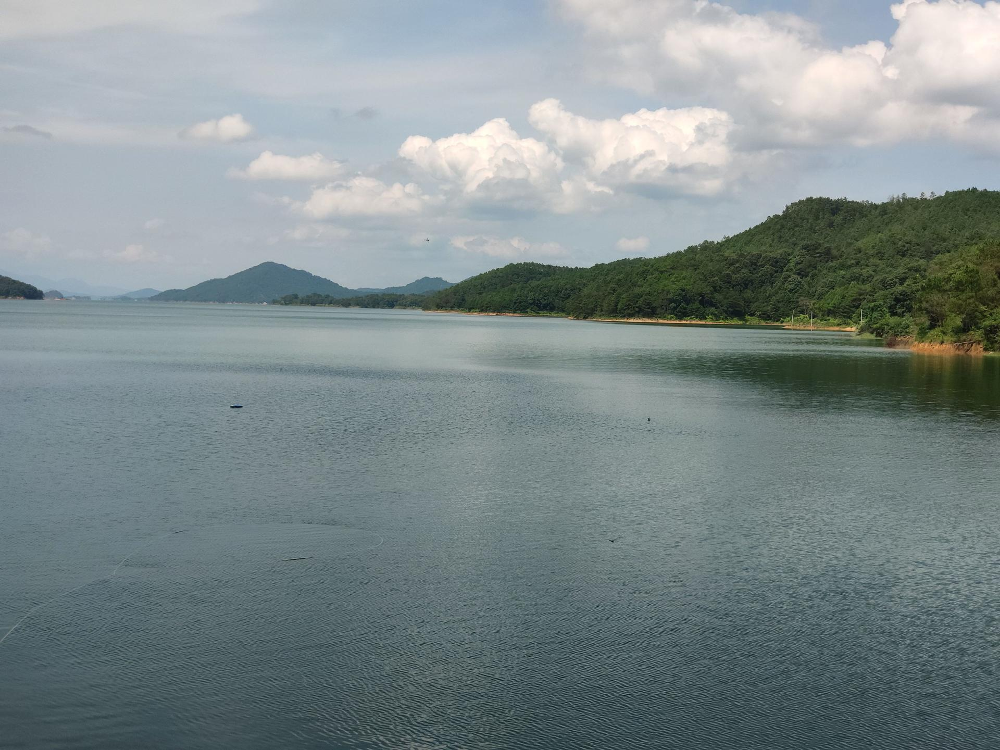

# 万绿湖风景区

## 景点图片

> 图片来源：[Wikimedia Commons](https://commons.wikimedia.org/wiki/File:万绿湖20190820.jpg) · 作者：Ruanlong · 拍摄时间：2019-08-20 · 许可证：[CC BY-SA 4.0](https://creativecommons.org/licenses/by-sa/4.0/)

## 基本信息

| 项目 | 内容 |
|------|------|
| 景点名称 | 万绿湖风景区 |
| 所在城市 | 河源市 |
| 所在区县 | 东源县 |
| 景点级别 | 4A级 |
| 景点类型 | 湖泊 |
| 开放时间 | 08:00-17:30 |
| 门票价格 | 免费（游船另计，约80-150元） |

## 景点介绍

万绿湖风景区位于广东省河源市东源县新港镇，依托新丰江水库形成湖区景观。湖水碧绿，湖中岛屿与周边山林构成了开阔的湖光山色。

万绿湖由新丰江水库蓄水而成，湖中共有360多个岛屿，星罗棋布于碧波荡漾的湖面之上。湖区内生态环境优越，森林覆盖率高达98%，空气中负氧离子含量极高，是天然的大氧吧。游客可以乘坐游船游览湖光山色，欣赏湖中岛屿的自然风光，也可以在湖边垂钓、野餐，享受宁静的自然时光。

万绿湖不仅是一处旅游胜地，更是河源市的生态名片。湖区内的水质常年保持在国家地表水Ⅰ类标准，清澈见底。每年春季，湖畔的桃花、李花竞相开放，与碧绿的湖水相映成趣，构成一幅美丽的山水画卷。

## 景点特点

- 华南地区最大的人工湖，水域面积达370平方公里
- 水质达到国家地表水Ⅰ类标准，清澈见底
- 湖中有360多个岛屿，生态环境优越
- 森林覆盖率高达98%，是天然的大氧吧
- 可乘游船游览湖光山色，体验水上风光

## 位置信息

- **地址**：广东省河源市东源县新港镇港中路17号
- **经纬度**：23.7751°N, 114.6319°E

## 交通信息

### 公交

- 从河源市区乘坐107路公交车至万绿湖站，约40分钟车程

### 自驾

- 从河源市区出发，沿河源大道北行，转X195县道，约15分钟车程
- 从广州出发，走广惠高速→惠河高速，约2小时车程
- 从深圳出发，走深惠高速→惠河高速，约2.5小时车程

## 数据来源

- [东源县国家A级旅游景区名录（2024年）](http://www.gddongyuan.gov.cn/hydywglj/gkmlpt/content/0/621/post_621985.html)

## 最后更新时间

2026-07-15
