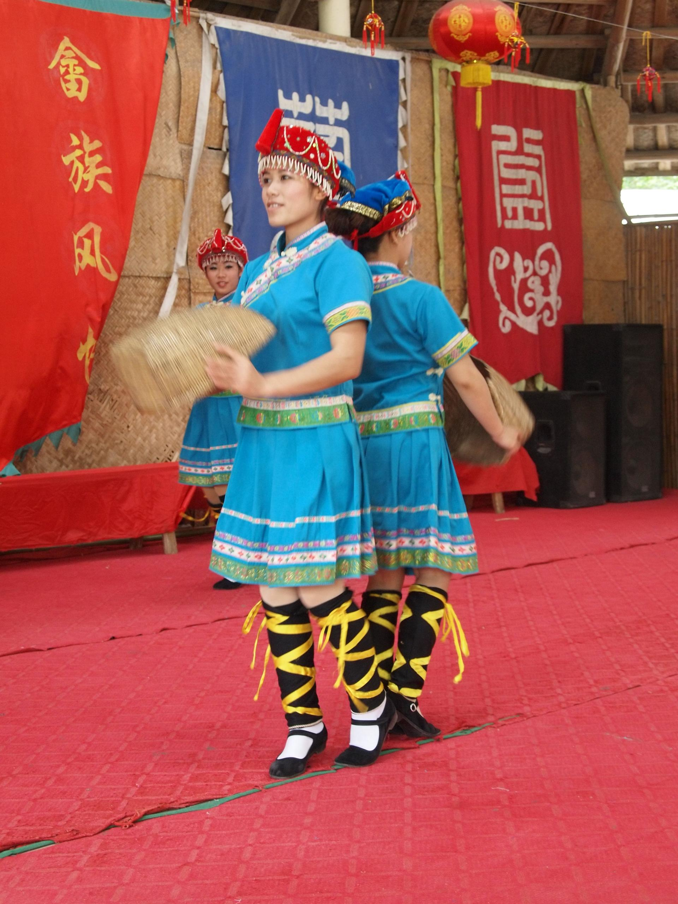

# 黄龙岩畲族风情旅游区

## 景点图片

> 图片来源：[Wikimedia Commons](https://commons.wikimedia.org/wiki/File:She_people_traditional_dance_performance_in_Huanglongyan,_Heyuan,_Guangdon.jpg) · 作者：Underbar dk · 拍摄时间：2014-04-20 · 许可证：[CC BY-SA 4.0](https://creativecommons.org/licenses/by-sa/4.0/)

## 基本信息

| 项目 | 内容 |
|------|------|
| 景点名称 | 黄龙岩畲族风情旅游区 |
| 所在城市 | 河源市 |
| 所在区县 | 东源县 |
| 景点级别 | 4A级 |
| 景点类型 | 畲族文化、乡村旅游 |
| 开放时间 | 以景区现场公告为准 |
| 门票价格 | 以景区现场公告为准 |

## 景点介绍

黄龙岩畲族风情旅游区位于东源县漳溪畲族乡，是展示当地畲族文化与乡村风貌的国家4A级旅游景区。

## 景点特点

- 位于漳溪畲族乡，具有鲜明的畲族文化特色
- 2024年东源县国家A级旅游景区名录记载的4A级景区

## 位置

- **地址**：河源市东源县漳溪畲族乡上蓝村
- **经纬度**：暂缺

## 交通

- **公交**：乡村公交班次较少，出行前请向当地交通部门核实
- **自驾**：导航至“黄龙岩畲族风情旅游区”，以实时路况为准

## 数据来源

- [东源县国家A级旅游景区名录（2024年）](http://www.gddongyuan.gov.cn/hydywglj/gkmlpt/content/0/621/post_621985.html)

## 最后更新时间

2026-07-15
