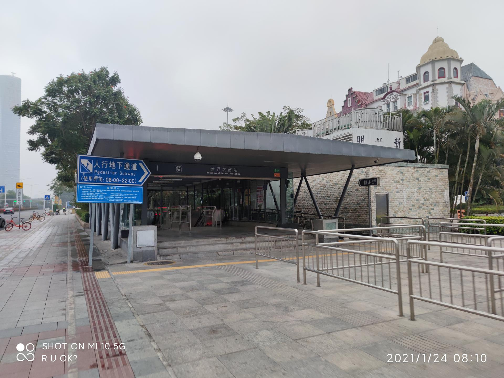

# 世界之窗

## 景点图片

> 图片来源：[Wikimedia Commons](https://commons.wikimedia.org/wiki/File%3A%E4%B8%96%E7%95%8C%E4%B9%8B%E7%AA%97%E7%AB%99_%E5%87%BA%E5%8F%A3%28I%29_%2820210124%29.jpg) · 许可证：CC BY-SA 4.0

## 基本信息

| 项目 | 内容 |
|------|------|
| 景点名称 | 世界之窗 |
| 所在城市 | 深圳市 |
| 所在区县 | 南山区 |
| 景点级别 | 4A |
| 景点类型 | 主题公园 |
| 开放时间 | 09:00-21:30（周一至周日） |
| 门票价格 | 200元 |

## 景点介绍

世界之窗是深圳著名的大型文化主题公园，位于南山区深南大道9037号，占地面积约48万平方米。景区以"弘扬世界文化精粹"为宗旨，荟萃了世界各地的文化景观、历史遗迹、名胜古迹等130多处微缩景观。

景区按世界地域结构和游览活动内容分为世界广场、亚洲区、欧洲区、非洲区、美洲区、大洋洲区、世界雕塑园和国际街八大区域。游客可以在一天之内"周游"世界，领略不同国家和地区的风情与文化。

世界之窗不仅是旅游胜地，也是深圳城市文化的重要标志之一。每年举办的各项主题活动和节庆庆典吸引了大量国内外游客，是了解世界多元文化的重要窗口。

## 景点特点

- 130多处世界著名景观的微缩复制品，涵盖五大洲的文化精华
- 夜间大型音乐喷泉及灯光秀演出，视觉效果震撼
- 国际风情街汇集各国特色商品和美食
- 定期举办大型主题活动和节庆演出

## 位置

- **地址**：南山区深南大道9037号
- **经纬度**：22.5355, 113.9650

## 交通

- **地铁**：1号线世界之窗站A出口，步行约5分钟
- **公交**：可乘坐多路公交车至世界之窗站下车
- **自驾**：导航至"世界之窗"，景区设有停车场

## 数据来源

- [深圳市文化广电旅游体育局](https://whly.sz.gov.cn/)

## 最后更新时间

2026-06-20
