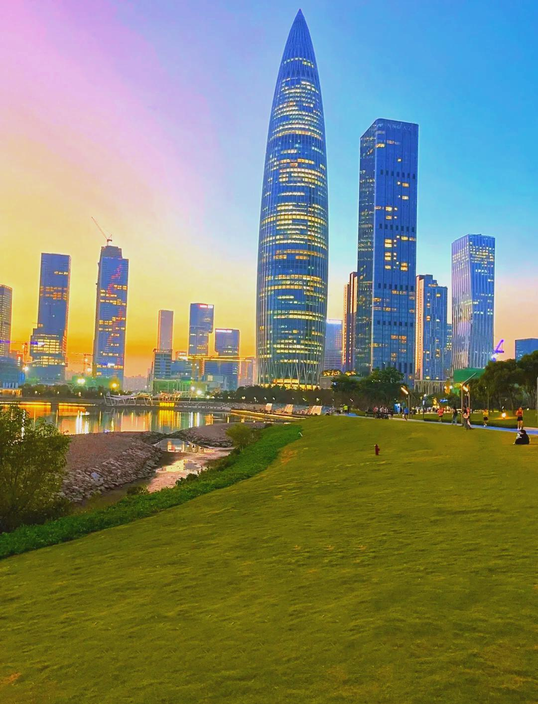

# 人才公园

## 景点图片

## 基本信息

| 项目 | 内容 |
|------|------|
| 景点名称 | 人才公园 |
| 所在城市 | 深圳市 |
| 所在区县 | 南山区 |
| 景点级别 | - |
| 景点类型 | 城市公园 |
| 开放时间 | 全天开放（6:00-22:00） |
| 门票价格 | 免费 |

## 景点介绍

人才公园位于深圳市南山区后海中心区，是深圳第一个以"人才"为主题的综合性公园，也是深圳市重要的市民休闲公共场所。公园于2017年1月正式对外开放，占地面积约23万平方米，水面面积约11万平方米。

公园以"人才"为主题，将文化、科技、生态等元素融为一体，打造了一个集社会、生态、休闲、观光于一体的城市公园。园内设有人才阁、人才雕塑、人才文化宣传展示馆等标志性景观，生动展示了深圳"尊重知识、尊重人才"的城市理念。

人才公园紧邻深圳湾公园，沿深圳湾修建了亲水滨海栈道，可欣赏深圳湾大桥和对岸香港新界的壮丽海景。夜晚，人才阁及周边建筑的灯光秀璀璨夺目，是深圳湾片区最具代表性的夜景之一。

## 景点特点

- 深圳首个以"人才"为主题的城市公园，主题鲜明独特
- 人才阁是公园标志性建筑，可登高俯瞰深圳湾全景
- 科技之光雕塑群以科技创新为主题，体现人才公园核心精神
- 滨海栈道可欣赏深圳湾大桥和香港天际线
- 夜景灯光秀出色，人才阁及沿岸建筑夜景尤为壮观
- 周边配套设施完善，紧邻深圳湾万象城

## 位置

- **地址**：南山区后海中心区（望海路与沙河西路交汇处附近）
- **经纬度**：22.5077°N, 113.9316°E## 交通

- **地铁**：2号线/11号线后海站D出口，步行约10分钟；部分公交线路直达"人才公园站"
- **公交**：M396路、M523路等线路至"人才公园站"下车即到
- **自驾**：经深圳湾大道或沙河西路可直达，公园周边设有配套停车位（节假日车位可能紧张）

## 数据来源

- [百度百科 - 深圳人才公园](https://baike.baidu.com/item/深圳人才公园/55202425)
- [深圳本地宝](https://sztz.bendibao.com/tour/rencaigongyuan/)

## 最后更新时间

2026-07-11
