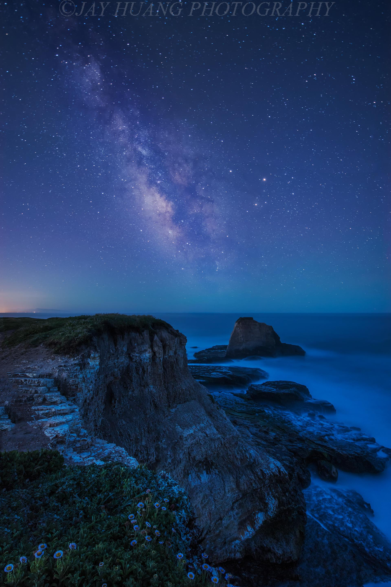

# 欢乐海岸海洋奇梦馆

## 景点图片

> 图片来源：[Wikimedia Commons](https://commons.wikimedia.org/wiki/File%3ASpring_Dream_-_Flickr_-_Jaykhuang.jpg) · 许可证：CC BY-SA 4.0

## 基本信息

| 项目 | 内容 |
|------|------|
| 景点名称 | 欢乐海岸海洋奇梦馆 |
| 所在城市 | 深圳市 |
| 所在区县 | 南山区 |
| 景点级别 | 无 |
| 景点类型 | 海洋馆 |
| 开放时间 | 10:00-18:00 |
| 门票价格 | 约120元/人 |

## 景点介绍

欢乐海岸海洋奇梦馆位于深圳市南山区欢乐海岸，是深圳市区内的室内海洋主题场馆，集海洋生物展示、互动体验和科普教育于一体。海洋馆占地面积约3000平方米，拥有各种海洋生物100多种。

海洋奇梦馆设有水母秘境、珊瑚礁展区、热带鱼展区、互动触摸池等多个主题区域。水母秘境是海洋馆的核心景点，展示了各种形态各异的水母，在灯光映衬下如梦如幻。互动触摸池可以让游客近距离接触海星、海胆等海洋生物。

欢乐海岸海洋奇梦馆是深圳市区内的海洋科普教育基地，也是亲子游的热门去处。

## 景点特点

- **市区海洋馆**：位于深圳市区内，交通便利
- **水母秘境**：展示各种形态各异的水母
- **珊瑚礁展区**：展示珊瑚礁生态系统
- **互动触摸池**：可近距离接触海洋生物
- **亲子首选**：深圳市区内的海洋科普教育基地

## 位置

- **地址**：深圳市南山区白石路东8号欢乐海岸购物中心内
- **经纬度**：22.5167°N, 113.9667°E

## 交通

- **地铁**：9号线深圳湾公园站
- **公交**：多路公交至欢乐海岸站
- **自驾**：可停放至欢乐海岸停车场

## 数据来源

- [百度百科-欢乐海岸海洋奇梦馆](https://baike.baidu.com/item/欢乐海岸海洋奇梦馆)

## 最后更新时间

2026-06-20
