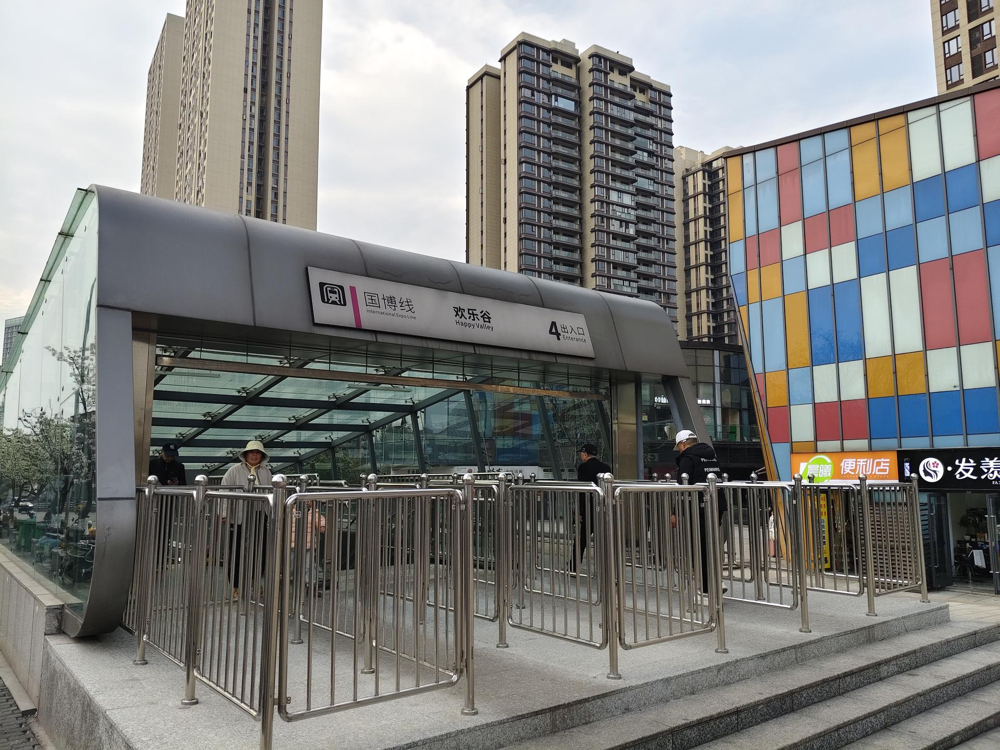

# 欢乐谷

## 景点图片

> 图片来源：[Wikimedia Commons](https://commons.wikimedia.org/wiki/File%3A%E6%AC%A2%E4%B9%90%E8%B0%B74.jpg) · 许可证：CC BY-SA 4.0

## 基本信息

| 项目 | 内容 |
|------|------|
| 景点名称 | 欢乐谷 |
| 所在城市 | 深圳市 |
| 所在区县 | 南山区 |
| 景点级别 | 4A |
| 景点类型 | 主题公园 |
| 开放时间 | 09:00-21:30（周一至周日） |
| 门票价格 | 230元 |

## 景点介绍

深圳欢乐谷是华侨城集团打造的大型文化主题公园，位于南山区侨城西街1号，占地面积约35万平方米。作为国内知名的连锁主题乐园品牌，深圳欢乐谷以其丰富的游乐项目和精彩的主题表演深受游客喜爱。

园区分为西班牙广场、魔幻城堡、冒险山、金矿镇、飓风湾、阳光海岸、欢乐时光、玛雅水公园等多个主题区域，拥有过山车、跳楼机、激流勇进等数十种大型游乐设施。其中玛雅水公园是夏季消暑的热门选择，提供多种水上娱乐项目。

欢乐谷每年定期举办万圣节、圣诞节等主题活动，引入国际知名IP合作项目，不断创新游玩体验。无论是亲子家庭还是年轻群体，都能在这里找到适合自己的欢乐项目。

## 景点特点

- 拥有数十种大型游乐设施，刺激与趣味兼具
- 玛雅水公园夏季开放，是消暑避暑的好去处
- 每年举办万圣节、圣诞节等大型主题活动
- 多个主题区域，风格各异，适合不同年龄段游客

## 位置

- **地址**：南山区侨城西街1号
- **经纬度**：22.5380, 113.9530

## 交通

- **地铁**：1号线/2号线世界之窗站A出口，步行约10分钟
- **公交**：可乘坐多路公交车至世界之窗站或欢乐谷站下车
- **自驾**：导航至"深圳欢乐谷"，景区设有停车场

## 数据来源

- [深圳欢乐谷官方网站](https://www.happyvalley.com/)

## 最后更新时间

2026-06-20
