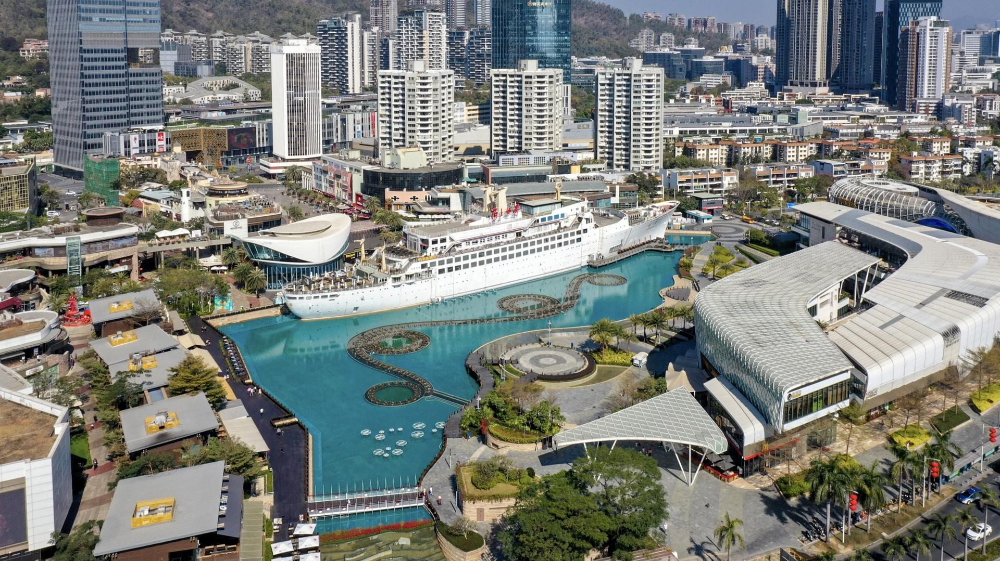

# 海上世界

## 景点图片

> 图片来源：[Wikimedia Commons](https://commons.wikimedia.org/wiki/File%3ASea_World_in_Shekou_Shenzhen2021.jpg) · 许可证：CC BY-SA 4.0

## 基本信息

| 项目 | 内容 |
|------|------|
| 景点名称 | 海上世界 |
| 所在城市 | 深圳市 |
| 所在区县 | 南山区 |
| 景点级别 | 无 |
| 景点类型 | 综合性滨海休闲区 |
| 开放时间 | 全天开放（海上世界文化艺术中心：10:00-21:00，周一闭馆） |
| 门票价格 | 免费（文化艺术中心及部分活动可能收费） |

## 景点介绍

海上世界位于深圳市南山区蛇口，是一个集文化、旅游、餐饮、购物、娱乐于一体的综合性滨海休闲区。其标志性景点是停泊在陆地上的"明华轮"——一艘由法国建造的豪华游轮，曾接待过多国政要，于1984年落户蛇口，成为深圳最具代表性的地标之一。

海上世界广场以明华轮为中心，周边环绕着海上世界文化艺术中心、海滨栈道、音乐喷泉、酒吧街和国际餐饮区。海上世界文化艺术中心由日本著名建筑师槇文彦设计，是深圳重要的文化地标，经常举办各类艺术展览和文化活动。

夜幕降临后，海上世界的音乐喷泉灯光秀尤为壮观，配合周边的霓虹灯光和海风，营造出独特的滨海夜生活氛围。这里也是深圳最具国际化氛围的休闲区之一，汇聚了来自世界各地的美食和文化。

## 景点特点

- **明华轮**：停泊在陆地上的标志性豪华游轮，深圳地标之一
- **海上世界文化艺术中心**：由槇文彦设计的文化地标，举办各类艺术展览
- **海滨栈道**：沿海休闲步道，可欣赏深圳湾海景
- **音乐喷泉**：夜间灯光水秀，绚丽壮观
- **国际餐饮**：汇聚世界各地美食，深圳最具国际化氛围的休闲区

## 位置

- **地址**：深圳市南山区蛇口望海路
- **经纬度**：22.4823°N, 113.9178°E

## 交通

- **地铁**：2号线/12号线海上世界站
- **公交**：22路、70路、79路、113路、122路、204路、226路、233路、328路、331路、332路、J1路、M400路、M409路等
- **自驾**：可停放至海上世界停车场

## 数据来源

- [海上世界 - 百度百科](https://baike.baidu.com/item/%E6%B5%B7%E4%B8%8A%E4%B8%96%E7%95%8C/10301)

## 最后更新时间

2026-06-20
