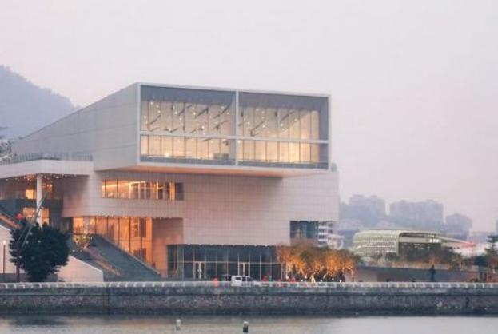

# 海上世界文化艺术中心

## 景点图片

## 基本信息

| 项目 | 内容 |
|------|------|
| 景点名称 | 海上世界文化艺术中心 |
| 所在城市 | 深圳市 |
| 所在区县 | 南山区 |
| 景点级别 | - |
| 景点类型 | 美术馆 / 文化中心 |
| 开放时间 | 周二至周日 10:00-19:00（周一闭馆，法定节假日除外） |
| 门票价格 | 免费（需提前预约） |

## 景点介绍

海上世界文化艺术中心位于深圳市南山区蛇口海上世界片区望海路1187号，是一座集展览、演出、会议、图书、音像、咨询于一体的综合性文化设施，也是深港文化合作的重要平台。

中心由日本著名建筑师槙文彦（Fumihiko Maki，普利兹克奖得主）设计，总建筑面积约3万平方米。建筑采用现代简约的设计风格，以"城市客厅"概念为灵感，通过开放式空间和自然光引入，打造了宜人的文化体验环境。

中心内设永久展览空间、临时展厅、艺术图书馆、电影院、多功能会议室等多个功能区域。其中最具代表性的是V&A博物馆深圳展陈（Victoria and Albert Museum Shenzhen Display），这是英国维多利亚和阿尔伯特博物馆在中国的首个海外展陈项目，展示级别极高，具有重要的文化价值。

天台设有露天观景平台，可俯瞰蛇口海上世界片区及海景，是拍照打卡的热门地点。

## 景点特点

- 由普利兹克奖得主、日本建筑大师槙文彦设计，建筑本身就是艺术品
- V&A博物馆在中国的首个海外展陈项目，文化规格极高
- 多功能文化设施：展览、艺术图书馆、电影院、咖啡厅等一应俱全
- 开放式空间设计，自然采光良好，天台可俯瞰海上世界片区及海景
- 免费开放，需提前在微信公众号预约
- 毗邻海上世界广场和蛇口码头，可与海上世界、南海意库等景点串联游览

## 位置

- **地址**：南山区望海路1187号（蛇口海上世界片区）
- **经纬度**：22.4823°N, 113.9178°E## 交通

- **地铁**：2号线（蛇口线）或12号线海上世界站A出口，步行约5分钟
- **公交**：多条公交线路可达蛇口海上世界片区，导航至"海上世界文化艺术中心"站或"蛇口码头"站下车
- **自驾**：沿湖路进入中心专用停车场（地下约200个车位），导航搜索"海上世界文化艺术中心"

## 参观须知

- 需提前在微信公众号/小程序"海上世界文化艺术中心"预约参观
- 入场需携带身份证原件 + 预约码，现场核验
- 每时段有人数限制，建议提前1-3天预约
- 建议游览时长：1.5-2小时

## 数据来源

- [百度百科 - 海上世界文化艺术中心](https://baike.baidu.com/item/海上世界文化艺术中心/54488155)
- [ArchDaily](https://www.archdaily.cn/cn/795293/hai-shang-shi-jie-wen-hua-yi-shu-zhong-xin-fumihiko-maki)
- [维基百科](https://zh.wikipedia.org/wiki/海上世界文化艺术中心)

## 最后更新时间

2026-07-11
