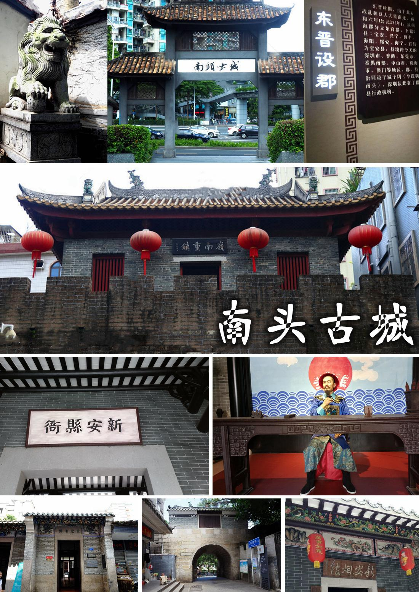

# 深圳南头古城

## 景点图片

## 基本信息

| 项目 | 内容 |
|------|------|
| 景点名称 | 深圳南头古城 |
| 所在城市 | 深圳市 |
| 所在区县 | 南山区 |
| 景点级别 | 4A |
| 景点类型 | 历史文化街区 |
| 开放时间 | 全天开放（街区商铺一般 9:00-22:00） |
| 门票价格 | 免费 |

## 景点介绍

南头古城，又称新安古城，位于广东省深圳市南山区南山大道1078号，紧邻北环大道，是一座拥有近1700年历史的古城，被誉为"深圳城市之源"。

古城最早可追溯至公元226年（三国时期），当时设立"东官郡"，为深圳地区的第一个行政机构。此后历经东晋、南朝、唐、宋、明、清各代修缮和扩建，古城格局逐步完善。明清时期，这里曾是"南头寨"的驻地，承担着重要的军事防御功能，也是历代新安县治所在地。

2019年起，深圳市政府对南头古城进行了大规模的保护性改造和复兴工程，引入文创产业、艺术设计、特色商业等元素，使其从一座单纯的古城遗址转变为集历史文化遗产保护与现代创意产业于一体的文化旅游目的地。如今的南头古城保留了古城墙遗址、城门楼、古井等丰富的历史遗存，同时汇聚了精品酒店、设计师买手店、独立咖啡馆、艺术展览空间和创意小店，成为深圳最受欢迎的文化地标和网红打卡地之一。

## 景点特点

- 深圳城市原点，深圳历史文化的起点
- 1700多年历史，保留了古城墙遗址、城门楼等历史遗迹
- 岭南传统建筑风格与现代文创产业完美融合
- 定期举办文化节庆活动、非遗手工艺体验、艺术展览等
- 夜晚灯光迷人，有酒吧和Livehouse增添现代都市活力

## 位置

- **地址**：南山区南山大道1078号（近北环大道）
- **经纬度**：22.5473°N, 113.915°E## 交通

- **地铁**：12号线南头古城站B口或C出口，步行约70米即达
- **公交**：多条公交线路途经附近，可在"南头古城"站下车
- **自驾**：沿北环大道或南山大道行驶即可到达，古城周边设有停车位

## 数据来源

- [百度百科 - 南头古城](https://baike.baidu.com/item/南头古城/10456789)
- [南头古城官网](https://www.ntgc.cn/)
- [深圳市文化广电旅游体育局](https://whly.sz.gov.cn/)

## 最后更新时间

2026-07-11
