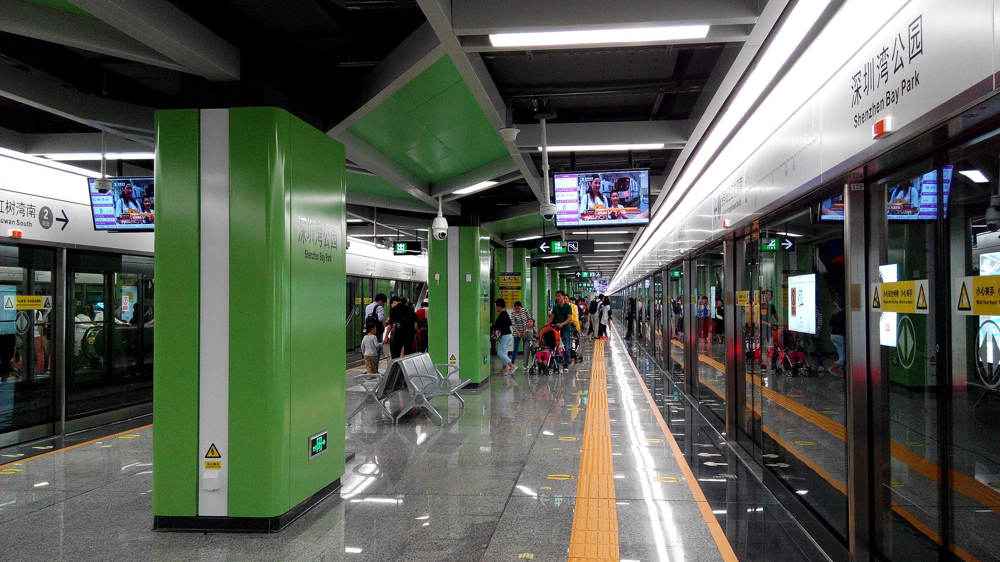

# 深圳湾公园

## 景点图片

> 图片来源：[Wikimedia Commons](https://commons.wikimedia.org/wiki/File%3AShenzhen_Metro_Line_9_Shenzhen_Bay_Park_Sta_Platform.jpg) · 许可证：CC BY-SA 4.0

## 基本信息

| 项目 | 内容 |
|------|------|
| 景点名称 | 深圳湾公园 |
| 所在城市 | 深圳市 |
| 所在区县 | 南山区 |
| 景点级别 | - |
| 景点类型 | 海滨公园 |
| 开放时间 | 全天开放 |
| 门票价格 | 免费 |

## 景点介绍

深圳湾公园位于深圳市南山区深圳湾畔，是深圳最美的海滨休闲长廊之一。公园沿海岸线绵延约13公里，东起红树林自然保护区，西至深圳湾口岸，串联了多个主题景观区，是深圳城市绿道系统的重要组成部分。

公园内设有海滨栈道、自行车道、观景平台等设施，沿途可欣赏到深圳湾的壮阔海景和对岸香港的自然风光。每年冬季，大批候鸟迁徙至此过冬，红树林湿地成为观鸟爱好者的天堂。深圳湾大桥横跨海湾，连接深港两地，日落时分景色尤为壮观。

深圳湾公园已成为深圳市民日常休闲、运动健身的首选场所之一。无论是晨跑、骑行还是傍晚散步，这里都能提供舒适的环境和优美的景色。

## 景点特点

- 沿海栈道约13公里，是深圳最美的海滨休闲长廊
- 红树林湿地是重要的候鸟栖息地，冬季观鸟胜地
- 可远眺深圳湾大桥及对岸香港风光
- 设有自行车道和多处观景平台，适合多种休闲活动

## 位置

- **地址**：南山区深圳湾（沿海岸线分布）
- **经纬度**：22.519°N, 113.9726°E## 交通

- **地铁**：2号线深圳湾公园站D2出口，直达海边
- **公交**：可乘坐M209路、M486路等公交车至深圳湾公园站下车
- **自驾**：导航至"深圳湾公园"，沿途有多处停车场

## 数据来源

- [深圳市城市管理和综合执法局](https://cg.sz.gov.cn/)

## 最后更新时间

2026-06-20
